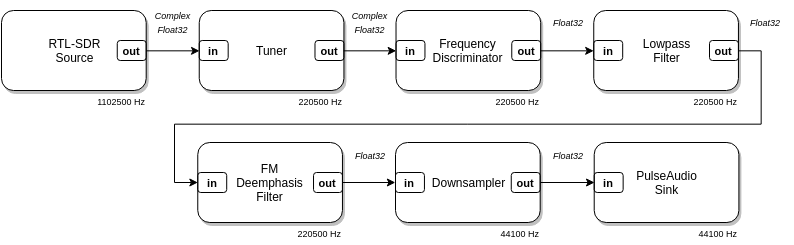

# LuaRadio [](https://travis-ci.com/vsergeev/luaradio) [](https://github.com/vsergeev/luaradio) [](https://github.com/vsergeev/luaradio/blob/master/LICENSE) [](https://luaradio.io/docs/reference-manual.html) [](https://groups.io/g/luaradio)

**LuaRadio** is a lightweight, embeddable flow graph signal processing
framework for software-defined radio. It provides a suite of source, sink, and
processing blocks, with a simple API for defining flow graphs, running flow
graphs, creating blocks, and creating data types. LuaRadio is built on
[LuaJIT](http://luajit.org/), has a small binary footprint of under 750 KB
(including LuaJIT), has no external hard dependencies, and is MIT licensed.

LuaRadio can be used to rapidly prototype software radios,
modulation/demodulation utilities, and signal processing experiments.  It can
also be embedded into existing radio applications to serve as a user scriptable
engine for signal processing.

LuaRadio blocks are written in pure Lua, but can use [LuaJIT's
FFI](http://luajit.org/ext_ffi.html) to wrap external libraries, like
[VOLK](http://libvolk.org/),
[liquid-dsp](https://github.com/jgaeddert/liquid-dsp), and others, for
computational acceleration, sophisticated processing, and interfacing with SDR
hardware.

Use GNU Radio? See [how LuaRadio compares to GNU
Radio](docs/6.comparison-gnuradio.md).

See the LuaRadio [mailing list](https://groups.io/g/luaradio) for general
discussion.

## Example

##### Wideband FM Broadcast Radio Receiver

<p align="center">

</p>

``` lua
local radio = require('radio')

radio.CompositeBlock():connect(
    radio.RtlSdrSource(88.5e6 - 250e3, 1102500), -- RTL-SDR source, offset-tuned to 88.5MHz-250kHz
    radio.TunerBlock(-250e3, 200e3, 5),          -- Translate -250 kHz, filter 200 kHz, decimate by 5
    radio.FrequencyDiscriminatorBlock(1.25),     -- Frequency demodulate with 1.25 modulation index
    radio.LowpassFilterBlock(128, 15e3),         -- Low-pass filter 15 kHz for L+R audio
    radio.FMDeemphasisFilterBlock(75e-6),        -- FM de-emphasis filter with 75 uS time constant
    radio.DownsamplerBlock(5),                   -- Downsample by 5
    radio.PulseAudioSink(1)                      -- Play to system audio with PulseAudio
):run()
```

Check out some more [examples](examples) of what you can build with LuaRadio.

## Quickstart

With LuaJIT installed, LuaRadio can be run directly from the repository:

```
git clone https://github.com/vsergeev/luaradio.git
```

``` shell
$ cd luaradio
$ ./luaradio --platform
luajit          LuaJIT 2.0.5
os              Linux
arch            x64
page size       4096
cpu count       4
cpu model       Intel(R) Core(TM) i5-4570T CPU @ 2.90GHz
features
    fftw3f      true    fftw-3.3.8-sse2-avx
    volk        true    2.0 (avx2_64_mmx_orc)
    liquid      true    1.3.2
$
```

LuaRadio is accelerated by the optional libraries
[liquid-dsp](https://github.com/jgaeddert/liquid-dsp),
[VOLK](http://libvolk.org/), and [fftw](http://www.fftw.org/). For best
real-time performance, install these libraries and check that the features are
marked `true` in the platform information:

* Arch Linux: `sudo pacman -S liquid-dsp libvolk fftw`
* macOS (Homebrew): `brew install liquid-dsp fftw`
* macOS (MacPorts): `sudo port install liquid-dsp volk fftw-3`
* Ubuntu/Debian/Raspbian: `sudo apt-get install libliquid-dev libvolk1-dev libfftw3-dev`
* Fedora/CentOS: `sudo yum install liquid-dsp fftw`

Try out one of the [examples](examples) with an
[RTL-SDR](http://www.rtl-sdr.com/about-rtl-sdr/) dongle:

```
$ ./luaradio examples/rtlsdr_wbfm_mono.lua 91.1e6
```

LuaRadio primarily supports Linux. It also strives to support FreeBSD and
macOS, but real-time and audio support on these platforms is currently
experimental. LuaRadio and all of its examples run great on the Raspberry Pi 3
with Arch Linux or Raspbian.

See the [Getting Started](docs/2.getting-started.md) guide for a tutorial on
building your own flow graphs.

## Installation

Arch Linux users can install LuaRadio with the AUR package `luaradio`.

macOS users can install LuaRadio with the Homebrew or MacPorts package `luaradio`.

See the [Installation](docs/1.installation.md) guide for other installation
methods and details.

## Project Roadmap

Check out the [project
roadmap](https://github.com/vsergeev/luaradio/wiki#project-roadmap) for
upcoming changes.

Contributions are welcome! See the [contributing document](CONTRIBUTING.md) for
guidelines.

## Documentation

LuaRadio documentation is contained in the [docs](docs) folder.

0. [Reference Manual](docs/0.reference-manual.md)
1. [Installation](docs/1.installation.md)
2. [Getting Started](docs/2.getting-started.md)
3. [Creating Blocks](docs/3.creating-blocks.md)
4. [Embedding LuaRadio](docs/4.embedding-luaradio.md)
5. [Architecture](docs/5.architecture.md)
6. [Comparison to GNU Radio](docs/6.comparison-gnuradio.md)
7. [Supported Hardware](docs/7.supported-hardware.md)

## Project Structure

* [radio/](radio) - Radio package
    * [core/](radio/core) - Core framework
    * [types/](radio/types) - Basic types
    * [utilities/](radio/utilities) - Utility classes and functions
    * [blocks/](radio/blocks) - Blocks
        * [sources/](radio/blocks/sources) - Sources
        * [sinks/](radio/blocks/sinks) - Sinks
        * [signal/](radio/blocks/signal) - Signal blocks
        * [protocol/](radio/blocks/protocol) - Protocol blocks
    * [composites/](radio/composites) - Composite blocks
    * [thirdparty/](radio/thirdparty) - Included third-party libraries
    * [init.lua](radio/init.lua) - Package init
* [examples/](examples) - Examples
* [embed/](embed) - Embeddable C library
    * [Makefile](embed/Makefile) - C library Makefile
    * [luaradio.c](embed/luaradio.c) - C API implementation
    * [luaradio.h](embed/luaradio.h) - C API header
    * [examples/](embed/examples) - C API examples
    * [tests/](embed/tests) - C API unit tests
* [benchmarks/](benchmarks/) - Benchmark suites
    * [luaradio_benchmark.lua](benchmarks/luaradio_benchmark.lua) - LuaRadio benchmark suite
    * [gnuradio_benchmark.py](benchmarks/gnuradio_benchmark.py) - GNU Radio benchmark suite
* [docs/](docs) - Documentation
    * [refman/](docs/refman) - Reference manual generator
* [tests/](tests) - Unit tests
* [CHANGELOG.md](CHANGELOG.md) - Change log
* [README.md](README.md) - This README
* [LICENSE](LICENSE) - MIT License
* [luaradio](luaradio) - `luaradio` runner helper script executable

## Testing

LuaRadio unit tests are run with [busted](http://olivinelabs.com/busted/).

Install `busted` with [LuaRocks](https://luarocks.org/):

```
sudo luarocks --lua-version=5.1 install busted
```

Run unit tests with:

```
busted
```

## License

LuaRadio is MIT licensed. See the included [LICENSE](LICENSE) file.
