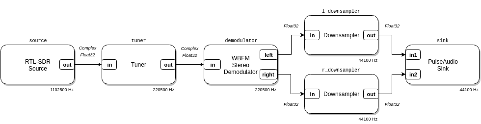

# LuaRadio Reference Manual

Generated from LuaRadio `v0.8.0`.

## Table of contents

* [Example](#example)
* [Running](#running)
    * [`luaradio` runner](#luaradio-runner)
    * [Environment Variables](#environment-variables)
* [Blocks](#blocks)
    * [Composition](#composition)
        * [CompositeBlock](#compositeblock)
    * [Sources](#sources)
        * [AirspyHFSource](#airspyhfsource)
        * [AirspySource](#airspysource)
        * [HackRFSource](#hackrfsource)
        * [IQFileSource](#iqfilesource)
        * [JSONSource](#jsonsource)
        * [NetworkClientSource](#networkclientsource)
        * [NetworkServerSource](#networkserversource)
        * [PortAudioSource](#portaudiosource)
        * [PulseAudioSource](#pulseaudiosource)
        * [RawFileSource](#rawfilesource)
        * [RealFileSource](#realfilesource)
        * [RtlSdrSource](#rtlsdrsource)
        * [SDRplaySource](#sdrplaysource)
        * [SignalSource](#signalsource)
        * [SoapySDRSource](#soapysdrsource)
        * [UHDSource](#uhdsource)
        * [UniformRandomSource](#uniformrandomsource)
        * [WAVFileSource](#wavfilesource)
        * [ZeroSource](#zerosource)
    * [Sinks](#sinks)
        * [BenchmarkSink](#benchmarksink)
        * [GnuplotPlotSink](#gnuplotplotsink)
        * [GnuplotSpectrumSink](#gnuplotspectrumsink)
        * [GnuplotWaterfallSink](#gnuplotwaterfallsink)
        * [GnuplotXYPlotSink](#gnuplotxyplotsink)
        * [HackRFSink](#hackrfsink)
        * [IQFileSink](#iqfilesink)
        * [JSONSink](#jsonsink)
        * [NetworkClientSink](#networkclientsink)
        * [NetworkServerSink](#networkserversink)
        * [NopSink](#nopsink)
        * [PortAudioSink](#portaudiosink)
        * [PrintSink](#printsink)
        * [PulseAudioSink](#pulseaudiosink)
        * [RawFileSink](#rawfilesink)
        * [RealFileSink](#realfilesink)
        * [SoapySDRSink](#soapysdrsink)
        * [UHDSink](#uhdsink)
        * [WAVFileSink](#wavfilesink)
    * [Filtering](#filtering)
        * [BandpassFilterBlock](#bandpassfilterblock)
        * [BandstopFilterBlock](#bandstopfilterblock)
        * [ComplexBandpassFilterBlock](#complexbandpassfilterblock)
        * [ComplexBandstopFilterBlock](#complexbandstopfilterblock)
        * [FIRFilterBlock](#firfilterblock)
        * [FMDeemphasisFilterBlock](#fmdeemphasisfilterblock)
        * [FMPreemphasisFilterBlock](#fmpreemphasisfilterblock)
        * [HighpassFilterBlock](#highpassfilterblock)
        * [IIRFilterBlock](#iirfilterblock)
        * [LowpassFilterBlock](#lowpassfilterblock)
        * [ManchesterMatchedFilterBlock](#manchestermatchedfilterblock)
        * [RootRaisedCosineFilterBlock](#rootraisedcosinefilterblock)
        * [SinglepoleHighpassFilterBlock](#singlepolehighpassfilterblock)
        * [SinglepoleLowpassFilterBlock](#singlepolelowpassfilterblock)
    * [Math Operations](#math-operations)
        * [AbsoluteValueBlock](#absolutevalueblock)
        * [AddBlock](#addblock)
        * [AddConstantBlock](#addconstantblock)
        * [ComplexConjugateBlock](#complexconjugateblock)
        * [ComplexMagnitudeBlock](#complexmagnitudeblock)
        * [ComplexPhaseBlock](#complexphaseblock)
        * [MultiplyBlock](#multiplyblock)
        * [MultiplyConjugateBlock](#multiplyconjugateblock)
        * [MultiplyConstantBlock](#multiplyconstantblock)
        * [SubtractBlock](#subtractblock)
    * [Level Control](#level-control)
        * [AGCBlock](#agcblock)
        * [PowerSquelchBlock](#powersquelchblock)
    * [Sample Rate Manipulation](#sample-rate-manipulation)
        * [DecimatorBlock](#decimatorblock)
        * [DownsamplerBlock](#downsamplerblock)
        * [InterpolatorBlock](#interpolatorblock)
        * [RationalResamplerBlock](#rationalresamplerblock)
        * [UpsamplerBlock](#upsamplerblock)
    * [Spectrum Manipulation](#spectrum-manipulation)
        * [FrequencyTranslatorBlock](#frequencytranslatorblock)
        * [HilbertTransformBlock](#hilberttransformblock)
        * [TunerBlock](#tunerblock)
    * [Carrier and Clock Recovery](#carrier-and-clock-recovery)
        * [PLLBlock](#pllblock)
        * [ZeroCrossingClockRecoveryBlock](#zerocrossingclockrecoveryblock)
    * [Digital](#digital)
        * [BinaryPhaseCorrectorBlock](#binaryphasecorrectorblock)
        * [DifferentialDecoderBlock](#differentialdecoderblock)
        * [ManchesterDecoderBlock](#manchesterdecoderblock)
        * [PreambleSamplerBlock](#preamblesamplerblock)
        * [SamplerBlock](#samplerblock)
        * [SlicerBlock](#slicerblock)
    * [Type Conversion](#type-conversion)
        * [ComplexToFloatBlock](#complextofloatblock)
        * [ComplexToImagBlock](#complextoimagblock)
        * [ComplexToRealBlock](#complextorealblock)
        * [FloatToComplexBlock](#floattocomplexblock)
        * [RealToComplexBlock](#realtocomplexblock)
    * [Miscellaneous](#miscellaneous)
        * [DeinterleaveBlock](#deinterleaveblock)
        * [DelayBlock](#delayblock)
        * [InterleaveBlock](#interleaveblock)
        * [NopBlock](#nopblock)
        * [ThrottleBlock](#throttleblock)
    * [Modulation](#modulation)
        * [FrequencyModulatorBlock](#frequencymodulatorblock)
        * [SSBModulator](#ssbmodulator)
    * [Demodulation](#demodulation)
        * [AMEnvelopeDemodulator](#amenvelopedemodulator)
        * [AMSynchronousDemodulator](#amsynchronousdemodulator)
        * [FrequencyDiscriminatorBlock](#frequencydiscriminatorblock)
        * [NBFMDemodulator](#nbfmdemodulator)
        * [SSBDemodulator](#ssbdemodulator)
        * [WBFMMonoDemodulator](#wbfmmonodemodulator)
        * [WBFMStereoDemodulator](#wbfmstereodemodulator)
    * [Protocol](#protocol)
        * [AX25FramerBlock](#ax25framerblock)
        * [AX25FramerBlock.AX25FrameType](#ax25framerblockax25frametype)
        * [IDMFramerBlock](#idmframerblock)
        * [IDMFramerBlock.IDMFrameType](#idmframerblockidmframetype)
        * [POCSAGDecoderBlock](#pocsagdecoderblock)
        * [POCSAGDecoderBlock.POCSAGMessageType](#pocsagdecoderblockpocsagmessagetype)
        * [POCSAGFramerBlock](#pocsagframerblock)
        * [POCSAGFramerBlock.POCSAGFrameType](#pocsagframerblockpocsagframetype)
        * [RDSDecoderBlock](#rdsdecoderblock)
        * [RDSDecoderBlock.RDSPacketType](#rdsdecoderblockrdspackettype)
        * [RDSFramerBlock](#rdsframerblock)
        * [RDSFramerBlock.RDSFrameType](#rdsframerblockrdsframetype)
        * [SCMFramerBlock](#scmframerblock)
        * [SCMFramerBlock.SCMFrameType](#scmframerblockscmframetype)
        * [SCMPlusFramerBlock](#scmplusframerblock)
        * [SCMPlusFramerBlock.SCMPlusFrameType](#scmplusframerblockscmplusframetype)
        * [VaricodeDecoderBlock](#varicodedecoderblock)
    * [Receivers](#receivers)
        * [AX25Receiver](#ax25receiver)
        * [BPSK31Receiver](#bpsk31receiver)
        * [ERTReceiver](#ertreceiver)
        * [POCSAGReceiver](#pocsagreceiver)
        * [RDSReceiver](#rdsreceiver)
* [Infrastructure](#infrastructure)
    * [Package](#package)
    * [Basic Types](#basic-types)
        * [ComplexFloat32](#complexfloat32)
        * [Float32](#float32)
        * [Bit](#bit)
        * [Byte](#byte)
    * [Type Factories](#type-factories)
        * [CStructType](#cstructtype)
        * [ObjectType](#objecttype)
    * [Vector](#vector)
        * [Vector](#vector-1)
        * [ObjectVector](#objectvector)
    * [Block](#block)
        * [Input](#input)
        * [Output](#output)
        * [Block](#block-1)
    * [Debug](#debug)
    * [Platform](#platform)

## Example

<p align="center">

</p>


``` lua
local radio = require('radio')

-- RTL-SDR Source, frequency 88.5 MHz - 250 kHz, sample rate 1102500 Hz
local source = radio.RtlSdrSource(88.5e6 - 250e3, 1102500)
-- Tuner block, translate -250 kHz, filter 200 kHz, decimate by 5
local tuner = radio.TunerBlock(-250e3, 200e3, 5)
-- Wideband FM Stereo Demodulator block
local demodulator = radio.WBFMStereoDemodulator()
-- Left and right AF downsampler blocks
local l_downsampler = radio.DownsamplerBlock(5)
local r_downsampler = radio.DownsamplerBlock(5)
-- Audio sink, 2 channels for left and right audio
local sink = radio.PulseAudioSink(2)
-- Top-level block
local top = radio.CompositeBlock()

-- Connect blocks in top block
top:connect(source, tuner, demodulator)
top:connect(demodulator, 'left', l_downsampler, 'in')
top:connect(demodulator, 'right', r_downsampler, 'in')
top:connect(l_downsampler, 'out', sink, 'in1')
top:connect(r_downsampler, 'out', sink, 'in2')

-- Run top block
top:run()
```

```
$ luaradio example.lua
```

## Running

LuaRadio scripts can be run with the `luaradio` runner, or directly with
`luajit`, if the `radio` package is installed in your Lua path.

### `luaradio` runner

The `luaradio` runner is a simple wrapper script for running LuaRadio scripts.
It can also print version information, dump relevant platform information, and
adjust the runtime debug verbosity of scripts. The runner modifies the Lua path
to support importing the `radio` package locally, so it can be used to run
LuaRadio scripts directly from the repository without installation.

```
$ ./luaradio
Usage: luaradio [options] <script> [args]

Options:
   -h, --help      Print help and exit
   --version       Print version and exit
   --platform      Dump platform and exit
   -v, --verbose   Enable debug verbosity
$
```

To run a script, use `luaradio` as you would use `luajit`:

```
$ luaradio script.lua
```

To run a script with debug verbosity:

```
$ luaradio -v script.lua
```

### Environment Variables

LuaRadio interprets several environment variables to adjust runtime settings.
These environment variables are treated as flags that can be enabled with value
`1` (or values `y`, `yes`, `true`).

* `LUARADIO_DEBUG` - Enable debug verbosity
* `LUARADIO_DISABLE_LIQUID` - Disable liquid-dsp library
* `LUARADIO_DISABLE_VOLK` - Disable volk library
* `LUARADIO_DISABLE_FFTW3F` - Disable fftw3f library

For example, to enable debug verbosity:

```
$ LUARADIO_DEBUG=1 luaradio script.lua
```

To disable use of the VOLK library:

```
$ LUARADIO_DISABLE_VOLK=1 luaradio script.lua
```

To run a script with no external libraries for acceleration:

```
$ LUARADIO_DISABLE_LIQUID=1 LUARADIO_DISABLE_VOLK=1 LUARADIO_DISABLE_FFTW3F=1 luaradio script.lua
```

## Blocks

### Composition

#### CompositeBlock

##### `radio.CompositeBlock()`

Create a block to hold a flow graph composition, for either top-level or
hierarchical purposes. Top-level blocks may be run with the `run()` method.

##### `CompositeBlock:connect(...)`

Connect blocks.

This method can be used in three ways:

**Linear block connections.** Connect the first output to the first input of
each adjacent block. This usage is convenient for connecting blocks that
only have one input port and output port (which is most blocks).

``` lua
top:connect(b1, b2, b3)
```

**Explicit block connections.** Connect a particular output of the first
block to a particular input of the second block. The output and input ports
are specified by name. This invocation is used to connect a block to another
block with multiple input ports.

``` lua
top:connect(b1, 'out', b2, 'in2')
```

**Alias port connections.** Alias a composite block's input or output port
to a concrete block's input or output port. This invocation is used for
connecting the boundary inputs and outputs of a hierarchical block.

``` lua
function MyHierarchicalBlock:instantiate()
    local b1, b2, b3 = ...

    ...

    self:connect(b1, b2, b3)

    self:connect(self, 'in', b1, 'in')
    self:connect(self, 'out', b3, 'out')
end
```

###### Arguments

* `...`: Blocks [and ports] to connect

###### Returns

* self (*CompositeBlock*)

###### Raises

* Output port of block not found error.
* Input port of block not found error.
* Input port of block already connected error.
* Unexpected number of output ports in block error.
* Unexpected number of input ports in block error.

##### `CompositeBlock:run()`

Run a top-level block. This is equivalent to calling `start()` followed by
`wait()` on the top-level block.

###### Returns

* self (*CompositeBlock*)

###### Raises

* Block already running error.
* Block input port unconnected error.
* Block input port sample rate mismatch error.
* No compatible type signatures found for block error.

###### Example

``` lua
-- Run a top-level block
top:run()
```

##### `CompositeBlock:start()`

Start a top-level block.

###### Returns

* self (*CompositeBlock*)

###### Raises

* Block already running error.
* Block input port unconnected error.
* Block input port sample rate mismatch error.
* No compatible type signatures found for block error.

###### Example

``` lua
-- Start a top-level block
top:start()
```

##### `CompositeBlock:status()`

Get the status of a top-level block.

###### Returns

* Status information with fields: `running` (bool). (*table*)

###### Example

``` lua
if top:status().running then
    print('Still running...')
end
```

##### `CompositeBlock:stop()`

Stop a top-level block and wait until it has finished.

###### Example

``` lua
-- Start a top-level block
top:start()
-- Stop a top-level block
top:stop()
```

##### `CompositeBlock:wait()`

Wait for a top-level block to finish, either by natural termination or by
`SIGINT`.

###### Example

``` lua
-- Start a top-level block
top:start()
-- Wait for the top-level block to finish
top:wait()
```

--------------------------------------------------------------------------------


### Sources

#### AirspyHFSource

Source a complex-valued signal from an Airspy HF+. This source requires the
libairspyhf library.

##### `radio.AirspyHFSource(frequency, rate[, options={}])`

###### Arguments

* `frequency` (*number*): Tuning frequency in Hz
* `rate` (*number*): Sample rate in Hz (192 kHz, 256 kHz, 384 kHz, 768 kHz)
* `options` (*table*): Additional options, specifying:
    * `hf_agc` (bool, default true)
    * `hf_agc_threshold` (string, default "low", choice of "low" or "high")
    * `hf_att` (int, default 0 dB, for manual attenuation when HF AGC is
      disabled, range of 0 to 48 dB, 6 dB step)
    * `hf_lna` (bool, default false)

###### Type Signatures

* ❑➔ `out` *ComplexFloat32*

###### Example

``` lua
-- Source samples from 91.1 MHz sampled at 768 kHz
local src = radio.AirspyHFSource(91.1e6, 768e3)

-- Source samples from 7.150 MHz sampled at 192 kHz, with HF AGC
-- enabled (default) and HF LNA enabled
local src = radio.AirspyHFSource(7.150e6, 192e3, {hf_lna = true})

-- Source samples from 14.175 MHz sampled at 192 kHz, with HF AGC disabled
-- and 24 dB HF attenuation
local src = radio.AirspyHFSource(14.175e6, 192e3, {hf_agc = false, hf_att = 24})
```

--------------------------------------------------------------------------------

#### AirspySource

Source a complex-valued signal from an Airspy. This source requires the
libairspy library. The Airspy R2 and Airspy Mini dongles are supported.

##### `radio.AirspySource(frequency, rate[, options={}])`

###### Arguments

* `frequency` (*number*): Tuning frequency in Hz
* `rate` (*number*): Sample rate in Hz (3 MHz or 6 MHz for Airspy Mini,
                                        2.5 MHz or 10 MHz for Airspy R2)
* `options` (*table*): Additional options, specifying:
    * `gain_mode` (string, default "linearity", choice of "custom", "linearity", "sensitivity")
    * `lna_gain` (int, default 5 dB, for custom gain mode, range 0 to 15 dB)
    * `mixer_gain` (int, default 1 dB, for custom gain mode, range 0 to 15 dB)
    * `vga_gain` (int, default 5 dB, for custom gain mode, range 0 to 15 dB)
    * `lna_agc` (bool, default false, for custom gain mode)
    * `mixer_agc` (bool, default false, for custom gain mode)
    * `linearity_gain` (int, default 10, for linearity gain mode, range 0 to 21)
    * `sensitivity_gain` (int, default 10, for sensitivity gain mode, range 0 to 21)
    * `biastee_enable` (bool, default false)

###### Type Signatures

* ❑➔ `out` *ComplexFloat32*

###### Example

``` lua
-- Source samples from 135 MHz sampled at 6 MHz
local src = radio.AirspySource(135e6, 6e6)

-- Source samples from 91.1 MHz sampled at 3 MHz, with custom gain settings
local src = radio.AirspySource(91.1e6, 3e6, {gain_mode = "custom", lna_gain = 4,
                                             mixer_gain = 1, vga_gain = 6})

-- Source samples from 91.1 MHz sampled at 2.5 MHz, with linearity gain mode
local src = radio.AirspySource(91.1e6, 2.5e6, {gain_mode = "linearity", linearity_gain = 8})

-- Source samples from 91.1 MHz sampled at 2.5 MHz, with sensitivity gain mode
local src = radio.AirspySource(91.1e6, 2.5e6, {gain_mode = "sensitivity", sensitivity_gain = 8})

-- Source samples from 144.390 MHz sampled at 2.5 MHz, with bias tee enabled
local src = radio.AirspySource(144.390e6, 2.5e6, {biastee_enable = true})
```

--------------------------------------------------------------------------------

#### HackRFSource

Source a complex-valued signal from a HackRF One. This source requires the
libhackrf library.

##### `radio.HackRFSource(frequency, rate[, options={}])`

###### Arguments

* `frequency` (*number*): Tuning frequency in Hz
* `rate` (*number*): Sample rate in Hz
* `options` (*table*): Additional options, specifying:
    * `lna_gain` (int, default 8 dB, range 0 to 40 dB, 8 dB step)
    * `vga_gain` (int, default 40 dB, range 0 to 62 dB, 2 dB step)
    * `bandwidth` (number in Hz, default round down from sample rate)
    * `rf_amplifier_enable` (bool, default false)
    * `antenna_power_enable` (bool, default false)

###### Type Signatures

* ❑➔ `out` *ComplexFloat32*

###### Example

``` lua
-- Source samples from 135 MHz sampled at 10 MHz
local src = radio.HackRFSource(135e6, 10e6)

-- Source samples from 135 MHz sampled at 10 MHz, with 2.5 MHz bandwidth
local src = radio.HackRFSource(135e6, 10e6, {bandwidth = 2.5e6})

-- Source samples from 91.1 MHz sampled at 8 MHz, with custom gain settings
local src = radio.HackRFSource(91.1e6, 8e6, {lna_gain = 16, vga_gain = 22})

-- Source samples from 144.390 MHz sampled at 8 MHz, with antenna power enabled
local src = radio.HackRFSource(144.390e6, 8e6, {antenna_power_enable = true})
```

--------------------------------------------------------------------------------

#### IQFileSource

Source a complex-valued signal from a binary "IQ" file. The file format may
be 8/16/32-bit signed/unsigned integers or 32/64-bit floats, in little or
big endianness, and interleaved as real component followed by imaginary
component.

##### `radio.IQFileSource(file, format, rate[, repeat_on_eof=false])`

###### Arguments

* `file` (*string*\|*file*\|*int*): Filename, file object, or file descriptor
* `format` (*string*): File format specifying signedness, bit width, and
                       endianness of samples. Choice of "s8", "u8", "u16le",
                       "u16be", "s16le", "s16be", "u32le", "u32be", "s32le",
                       "s32be", "f32le", "f32be", "f64le", "f64be".
* `rate` (*number*): Sample rate in Hz
* `repeat_on_eof` (*bool*): Repeat on end of file

###### Type Signatures

* ❑➔ `out` *ComplexFloat32*

###### Example

``` lua
-- Source signed 8-bit IQ samples from a file sampled at 1 MHz
local src = radio.IQFileSource('samples.s8.iq', 's8', 1e6)

-- Source little-endian 32-bit IQ samples from a file sampled at 1 MHz, repeating on EOF
local src = radio.IQFileSource('samples.f32le.iq', 'f32le', 1e6, true)

-- Source little-endian signed 16-bit IQ samples from stdin sampled at 500 kHz
local src = radio.IQFileSource(io.stdin, 's16le', 500e3)
```

--------------------------------------------------------------------------------

#### JSONSource

Source a signal from a JSON file. Samples are deserialized from individual,
newline delimited objects. This source supports any data type that
implements `from_json()`.

##### `radio.JSONSource(file, data_type, rate[, repeat_on_eof=false])`

###### Arguments

* `file` (*string*\|*file*\|*int*): Filename, file object, or file descriptor
* `data_type` (*type*): LuaRadio data type that implements `from_json()`
* `rate` (*number*): Sample rate of file
* `repeat_on_eof` (*bool*): Repeat on end of file

###### Type Signatures

* ❑➔ `out` *data_type*

###### Example

``` lua
-- Source AX25FrameType samples sampled at 1 Hz from a file descriptor
local src = radio.JSONSource(3, radio.AX25FramerBlock.AX25FrameType, 1)

-- Source AX25FrameType samples sampled at 1 Hz from a file, repeating on EOF
local src = radio.JSONSource('data.bin', radio.AX25FramerBlock.AX25FrameType, 1, true)
```

--------------------------------------------------------------------------------

#### NetworkClientSource

Source a signal from a network client. The source supports TCP and UNIX
socket transports. The samples are deserialized according to the specified
signedness, bit width, and endianness format.  Complex-valued signals are
deinterleaved as real component followed by imaginary component.  C
structure types may be deserialized raw with the "raw" format. Object types
may be deserialized from newline delimited JSON with the "json" format.
The source can be configured to automatically reconnect (default) or
terminate on connection loss.

##### `radio.NetworkClientSource(data_type, rate, format, transport, address[, options={}])`

###### Arguments

* `data_type` (*string*): LuaRadio data type
* `rate` (*number*): Sample rate of data
* `format` (*string*): Binary format of the samples specifying signedness,
                       bit width, and endianness of samples, or "raw" (for
                       raw serialization, useful for C structure types), or
                       "json" (for JSON serialization, useful for Object
                       types). Choice of "s8", "u8", "u16le", "u16be",
                       "s16le", "s16be", "u32le", "u32be", "s32le", "s32be",
                       "f32le", "f32be", "f64le", "f64be", "raw", "json".
* `transport` (*string*): Transport type. Choice of "tcp" or "unix".
* `address` (*string*): Address, as host:port for TCP, or as a file path for
                        UNIX.
* `options` (*table*): Additional options, specifying:
    * `reconnect` (bool, default true, reconnect on
      connection loss)

###### Type Signatures

* ❑➔ `out` *data_type*

###### Example

``` lua
-- Source ComplexFloat32 samples sampled at 1 MHz decoded from little-endian
-- 32-bit float format from a TCP client connected to 192.168.1.105:5000
local src = radio.NetworkClientSource(radio.types.ComplexFloat32, 1e6, 'f32le', 'tcp', '192.168.1.105:5000')

-- Source Float32 samples sampled at 100 kHz decoded from little-endian
-- signed 16-bit real format from a UNIX socket client connected to
-- /tmp/radio.sock
local src = radio.NetworkClientSource(radio.types.Float32, 100e3, 's16le', 'unix', '/tmp/radio.sock')

-- Source RDSFrameType samples decoded from their C structure from a TCP
-- client connected to 192.168.1.105:5000
local src = radio.NetworkClientSource(radio.RDSFramerBlock.RDSFrameType, 0, 'raw', 'tcp', '192.168.1.105:5000')

-- Source RDSPacketType samples decoded from their JSON format from a TCP
-- client connected to 192.168.1.105:5000
local src = radio.NetworkClientSource(radio.RDSDecoderBlock.RDSPacketType, 0, 'json', 'tcp', '192.168.1.105:5000')
```

--------------------------------------------------------------------------------

#### NetworkServerSource

Source a signal from a network server. The source supports TCP and UNIX
socket transports. The samples are deserialized according to the specified
signedness, bit width, and endianness format.  Complex-valued signals are
deinterleaved as real component followed by imaginary component.  C
structure types may be deserialized raw with the "raw" format. Object types
may be deserialized from newline delimited JSON with the "json" format.
The source can be configured to automatically reconnect (default) or
terminate on connection loss.

##### `radio.NetworkServerSource(data_type, rate, format, transport, address[, options={}])`

###### Arguments

* `data_type` (*string*): LuaRadio data type
* `rate` (*number*): Sample rate of data
* `format` (*string*): Binary format of the samples specifying signedness,
                       bit width, and endianness of samples, or "raw" (for
                       raw serialization, useful for C structure types), or
                       "json" (for JSON serialization, useful for Object
                       types). Choice of "s8", "u8", "u16le", "u16be",
                       "s16le", "s16be", "u32le", "u32be", "s32le", "s32be",
                       "f32le", "f32be", "f64le", "f64be", "raw", "json".
* `transport` (*string*): Transport type. Choice of "tcp" or "unix".
* `address` (*string*): Address, as host:port for TCP, or as a file path for
                        UNIX.
* `options` (*table*): Additional options, specifying:
    * `reconnect` (bool, default true, reconnect on
      connection loss)

###### Type Signatures

* ❑➔ `out` *data_type*

###### Example

``` lua
-- Source ComplexFloat32 samples sampled at 1 MHz decoded from little-endian
-- 32-bit float format from a TCP server listening on 0.0.0.0:5000
local src = radio.NetworkServerSource(radio.types.ComplexFloat32, 1e6, 'f32le', 'tcp', '0.0.0.0:5000')

-- Source Float32 samples sampled at 100 kHz decoded from little-endian
-- signed 16-bit real format from a UNIX socket server listening on
-- /tmp/radio.sock
local src = radio.NetworkServerSource(radio.types.Float32, 100e3, 's16le', 'unix', '/tmp/radio.sock')

-- Source RDSFrameType samples decoded from their C structure from a TCP
-- server listening on 0.0.0.0:5000
local src = radio.NetworkServerSource(radio.RDSFramerBlock.RDSFrameType, 0, 'raw', 'tcp', '0.0.0.0:5000')

-- Source RDSPacketType samples decoded from their JSON format from a TCP
-- server listening on 0.0.0.0:5000
local src = radio.NetworkServerSource(radio.RDSDecoderBlock.RDSPacketType, 0, 'json', 'tcp', '0.0.0.0:5000')
```

--------------------------------------------------------------------------------

#### PortAudioSource

Source one or more real-valued signals from the system's audio device with
PortAudio. This source requires PortAudio.

##### `radio.PortAudioSource(num_channels, rate)`

###### Arguments

* `num_channels` (*int*): Number of channels (e.g. 1 for mono, 2 for stereo)
* `rate` (*int*): Sample rate in Hz

###### Type Signatures

* ❑➔ `out` *Float32*
* ❑➔ `out1` *Float32*, `out2` *Float32*, `...`

###### Example

``` lua
-- Source one channel (mono) audio sampled at 44100 Hz
local src = radio.PortAudioSource(1, 44100)

-- Source two channel (stereo) audio sampled at 48000 Hz
local src = radio.PortAudioSource(2, 48000)
-- Compose the two channels into a complex-valued signal
local floattocomplex = radio.FloatToComplex()
top:connect(src, 'out1', floattocomplex, 'real')
top:connect(src, 'out2', floattocomplex, 'imag')
top:connect(floattocomplex, ...)
```

--------------------------------------------------------------------------------

#### PulseAudioSource

Source one or more real-valued signals from the system's audio device with
PulseAudio. This source requires PulseAudio.

##### `radio.PulseAudioSource(num_channels, rate)`

###### Arguments

* `num_channels` (*int*): Number of channels (e.g. 1 for mono, 2 for stereo)
* `rate` (*int*): Sample rate in Hz

###### Type Signatures

* ❑➔ `out` *Float32*
* ❑➔ `out1` *Float32*, `out2` *Float32*, `...`

###### Example

``` lua
-- Source one channel (mono) audio sampled at 44100 Hz
local src = radio.PulseAudioSource(1, 44100)

-- Source two channel (stereo) audio sampled at 48000 Hz
local src = radio.PulseAudioSource(2, 48000)
-- Compose the two channels into a complex-valued signal
local floattocomplex = radio.FloatToComplex()
top:connect(src, 'out1', floattocomplex, 'real')
top:connect(src, 'out2', floattocomplex, 'imag')
top:connect(floattocomplex, ...)
```

--------------------------------------------------------------------------------

#### RawFileSource

Source a signal of the specified data type from a binary file. The raw
binary samples are cast to the specified data type with no signedness
conversion, endian conversion, or interpretation. This is useful for
serializing data types across a pipe or other file descriptor based IPC.

##### `radio.RawFileSource(file, data_type, rate[, repeat_on_eof=false])`

###### Arguments

* `file` (*string*\|*file*\|*int*): Filename, file object, or file descriptor
* `data_type` (*type*): LuaRadio data type
* `rate` (*number*): Sample rate of file
* `repeat_on_eof` (*bool*): Repeat on end of file

###### Type Signatures

* ❑➔ `out` *data_type*

###### Example

``` lua
-- Source ComplexFloat32 samples sampled at 1 MHz from a file descriptor
local src = radio.RawFileSource(3, radio.types.ComplexFloat32, 1e6)

-- Source Byte samples sampled at 100 kHz from a file, repeating on EOF
local src = radio.RawFileSource('data.bin', radio.types.Byte, 100e3, true)
```

--------------------------------------------------------------------------------

#### RealFileSource

Source a real-valued signal from a binary file. The file format may be
8/16/32-bit signed/unsigned integers or 32/64-bit floats, in little or big
endianness. This is the real-valued counterpart of
[`IQFileSource`](#iqfilesource).

##### `radio.RealFileSource(file, format, rate[, repeat_on_eof=false])`

###### Arguments

* `file` (*string*\|*file*\|*int*): Filename, file object, or file descriptor
* `format` (*string*): File format specifying signedness, bit width, and
                       endianness of samples. Choice of "s8", "u8", "u16le",
                       "u16be", "s16le", "s16be", "u32le", "u32be", "s32le",
                       "s32be", "f32le", "f32be", "f64le", "f64be".
* `rate` (*number*): Sample rate in Hz
* `repeat_on_eof` (*bool*): Repeat on end of file

###### Type Signatures

* ❑➔ `out` *Float32*

###### Example

``` lua
-- Source signed 8-bit real samples from a file sampled at 1 MHz
local src = radio.RealFileSource('samples.s8.real', 's8', 1e6)

-- Source little-endian 32-bit real samples from a file sampled at 1 MHz, repeating on EOF
local src = radio.RealFileSource('samples.f32le.real', 'f32le', 1e6, true)

-- Source little-endian signed 16-bit real samples from stdin sampled at 500 kHz
local src = radio.RealFileSource(0, 's16le', 500e3)
```

--------------------------------------------------------------------------------

#### RtlSdrSource

Source a complex-valued signal from an RTL-SDR dongle. This source requires
the librtlsdr library.

##### `radio.RtlSdrSource(frequency, rate[, options={}])`

###### Arguments

* `frequency` (*number*): Tuning frequency in Hz
* `rate` (*number*): Sample rate in Hz
* `options` (*table*): Additional options, specifying:
    * `biastee` (bool, default false)
    * `direct_sampling` (string, default "disabled", choice of "disabled", "i", "q")
    * `bandwidth` (number, default equal to sample rate)
    * `autogain` (bool, default false)
    * `rf_gain` (number, default closest supported to 10.0 dB)
    * `freq_correction` PPM (number, default 0.0)
    * `device_index` (integer, default 0)

###### Type Signatures

* ❑➔ `out` *ComplexFloat32*

###### Example

``` lua
-- Source samples from 162.400 MHz sampled at 1 MHz, with autogain enabled
local src = radio.RtlSdrSource(162.400e6, 1e6, {autogain = true})

-- Source samples from 91.1 MHz sampled at 1.102500 MHz, with -1 PPM correction
local src = radio.RtlSdrSource(91.1e6, 1102500, {freq_correction = -1.0})

-- Source samples from 144.390 MHz sampled at 1 MHz, with RF gain of 15dB
local src = radio.RtlSdrSource(144.390e6, 1e6, {rf_gain = 15.0})
```

--------------------------------------------------------------------------------

#### SDRplaySource

Source a complex-valued signal from an SDRplay RSP. This source requires the
libmirsdrapi-rsp library.

##### `radio.SDRplaySource(frequency, rate[, options={}])`

###### Arguments

* `frequency` (*number*): Tuning frequency in Hz
* `rate` (*number*): Sample rate in Hz
* `options` (*table*): Additional options, specifying:
    * `gain_reduction` (int, default 80 dB, range of 0 to 102 dB)
    * `bandwidth` (number, default closest, choice of 0.200 MHz, 0.300 MHz,
      0.600 MHz, 1.536 MHz, 5.000 MHz, 6.000 MHz, 7.000 MHz, 8.000 MHz)

###### Type Signatures

* ❑➔ `out` *ComplexFloat32*

###### Example

``` lua
-- Source samples from 91.1 MHz sampled at 2 MHz
local src = radio.SDRplaySource(91.1e6, 2e6)

-- Source samples from 144.390 MHz sampled at 4 MHz, with 0.6 MHz bandwidth
local src = radio.SDRplaySource(144.390e6, 4e6, {bandwidth = 0.6e6})

-- Source samples from 15 MHz sampled at 10 MHz, with 75 dB gain reduction
local src = radio.SDRplaySource(15e6, 10e6, {gain_reduction = 75})
```

--------------------------------------------------------------------------------

#### SignalSource

Source a complex or real valued signal from a signal generator.

Note: the "exponential" waveform generates a complex-valued signal, all
other waveform types generate a real-valued signal.

##### `radio.SignalSource(signal, frequency, rate[, options={}])`

###### Arguments

* `signal` (*string*): Waveform type, either "exponential", "cosine", "sine",
                       "square", "triangle", "sawtooth", "constant".
* `frequency` (*number*): Frequency in Hz
* `rate` (*number*\|*nil*): Sample rate in Hz
* `options` (*table*): Additional options, specifying:
    * `amplitude` (number, default 1.0)
    * `offset` (number, default 0.0)
    * `phase` (number in radians, default 0.0)

###### Type Signatures

* ❑➔ `out` *ComplexFloat32*
* ❑➔ `out` *Float32*

###### Example

``` lua
-- Source a 250 kHz complex exponential sampled at 2 MHz
local src = radio.SignalSource('exponential', 250e3, 2e6)

-- Source a 100 kHz cosine sampled at 1 MHz, with amplitude 2.5
local src = radio.SignalSource('cosine', 100e3, 1e6, {amplitude = 2.5})

-- Source a 1 kHz square wave sampled at 2 MHz, with offset 1.0
local src = radio.SignalSource('square', 1e3, 2e6, {offset = 1.0})
```

--------------------------------------------------------------------------------

#### SoapySDRSource

Source a complex-valued signal from a SoapySDR device. This source requires
[SoapySDR](https://github.com/pothosware/SoapySDR).

##### `radio.SoapySDRSource(driver, frequency, rate[, options={}])`

###### Arguments

* `driver` (*string*\|*table*): Driver string or key-value table
* `frequency` (*number*): Tuning frequency in Hz
* `rate` (*number*): Sample rate in Hz
* `options` (*table*): Additional options, specifying:
    * `channel` (int, default 0)
    * `bandwidth` (number in Hz)
    * `autogain` (bool)
    * `antenna` (string)
    * `gain` (number in dB, overall gain)
    * `gains` (table, gain element name to value in dB)
    * `frequencies` (table, frequency element name to value in Hz)
    * `settings` (table, string key-value pairs of driver-specific settings)

###### Type Signatures

* ❑➔ `out` *ComplexFloat32*

###### Example

``` lua
-- Source samples from an RTL-SDR at 91.1 MHz sampled at 1 MHz
local src = radio.SoapySDRSource("driver=rtlsdr", 91.1e6, 1e6)

-- Source samples from an Airspy at 15 MHz sampled at 6 MHz, with 10 dB overall gain
local src = radio.SoapySDRSource("driver=airspy", 15e6, 6e6, {gain = 10})

-- Source samples from a LimeSDR at 915 MHz sampled at 10 MHz,
-- with 20 dB overall gain and 4 MHz baseband bandwidth
local src = radio.SoapySDRSource("driver=limesdr", 915e6, 10e6, {gain = 20, bandwidth = 4e6})

-- Source samples from a HackRF at 144.390 MHz sampled at 8 MHz,
-- with 2.5 MHz baseband bandwidth
local src = radio.SoapySDRSource("driver=hackrf", 144.390e6, 8e6, {bandwidth = 2.5e6})
```

--------------------------------------------------------------------------------

#### UHDSource

Source a complex-valued signal from a USRP. This source requires the libuhd
library.

##### `radio.UHDSource(device_address, frequency, rate[, options={}])`

###### Arguments

* `device_address` (*string*): Device address string
* `frequency` (*number*): Tuning frequency in Hz
* `rate` (*number*): Sample rate in Hz
* `options` (*table*): Additional options, specifying:
    * `channel` (int, default 0)
    * `gain` (number in dB, overall gain, default 15.0 dB)
    * `bandwidth` (number in Hz)
    * `antenna` (string)
    * `autogain` (bool, default false)
    * `gains` (table, gain element name to value in dB)

###### Type Signatures

* ❑➔ `out` *ComplexFloat32*

###### Example

``` lua
-- Source samples from a B200 at 91.1 MHz sampled at 2 MHz
local src = radio.UHDSource("type=b200", 91.1e6, 2e6)

-- Source samples from a B200 at 915 MHz sampled at 10 MHz, with 20 dB
-- overall gain
local src = radio.UHDSource("type=b200", 915e6, 10e6, {gain = 20})

-- Source samples from a B200 at 144.390 MHz sampled at 8 MHz, with 2.5 MHz
-- baseband bandwidth
local src = radio.UHDSource("type=b200", 144.390e6, 8e6, {bandwidth = 2.5e6})
```

--------------------------------------------------------------------------------

#### UniformRandomSource

Source a signal with values drawn from a uniform random distribution.

##### `radio.UniformRandomSource(data_type, rate[, range={}, options={}])`

###### Arguments

* `data_type` (*type*): LuaRadio data type, choice of
                        `radio.types.ComplexFloat32`, `radio.types.Float32`,
                        `radio.types.Byte`, or `radio.types.Bit` data types.
* `rate` (*number*): Sample rate in Hz
* `range` (*array*): Value range as an array, e.g `{10, 100}`.
* `options` (*table*): Additional options, specifying:
    * `seed` (number)

###### Type Signatures

* ❑➔ `out` *ComplexFloat32*
* ❑➔ `out` *Float32*
* ❑➔ `out` *Byte*
* ❑➔ `out` *Bit*

###### Example

``` lua
-- Source a random ComplexFloat32 signal sampled at 1 MHz
local src = radio.UniformRandomSource(radio.types.ComplexFloat32, 1e6)

-- Source a random Float32 signal sampled at 1 MHz
local src = radio.UniformRandomSource(radio.types.Float32, 1e6)

-- Source a random Byte signal sampled at 1 kHz, ranging from 65 to 90
local src = radio.UniformRandomSource(radio.types.Byte, 1e3, {65, 90})

-- Source a random bit stream sampled at 1 kHz
local src = radio.UniformRandomSource(radio.types.Bit, 1e3)
```

--------------------------------------------------------------------------------

#### WAVFileSource

Source one or more real-valued signals from a WAV file. The supported sample
formats are 8-bit unsigned integer, 16-bit signed integer, and 32-bit signed
integer.

##### `radio.WAVFileSource(file, num_channels[, repeat_on_eof=false])`

###### Arguments

* `file` (*string*\|*file*\|*int*): Filename, file object, or file descriptor
* `num_channels` (*int*): Number of channels (e.g. 1 for mono, 2 for stereo, etc.)
* `repeat_on_eof` (*bool*): Repeat on end of file

###### Type Signatures

* ❑➔ `out` *Float32*
* ❑➔ `out1` *Float32*, `out2` *Float32*, `...`

###### Example

``` lua
-- Source one channel WAV file
local src = radio.WAVFileSource('test.wav', 1)

-- Source two channel WAV file
local src = radio.WAVFileSource('test.wav', 2)
-- Compose the two channels into a complex-valued signal
top:connect(src, 'out1', floattocomplex, 'real')
top:connect(src, 'out2', floattocomplex, 'imag')
top:connect(floattocomplex, ..., snk)
```

--------------------------------------------------------------------------------

#### ZeroSource

Source a zero-valued signal of the specified data type.

##### `radio.ZeroSource(data_type, rate)`

###### Arguments

* `data_type` (*type*): LuaRadio data type
* `rate` (*number*): Sample rate in Hz

###### Type Signatures

* ❑➔ `out` *data_type*

###### Example

``` lua
-- Source a zero complex-valued signal sampled at 1 MHz
local src = radio.ZeroSource(radio.types.ComplexFloat32, 1e6)

-- Source a zero real-valued signal sampled at 500 kHz
local src = radio.ZeroSource(radio.types.Bit, 500e3)

-- Source a zero bit stream sampled at 2 kHz
local src = radio.ZeroSource(radio.types.Bit, 2e3)
```

--------------------------------------------------------------------------------


### Sinks

#### BenchmarkSink

Report the average rate of samples delivered to the sink.

```
[BenchmarkSink] 314.38 MS/s (2.52 GB/s)
[BenchmarkSink] 313.32 MS/s (2.51 GB/s)
[BenchmarkSink] 313.83 MS/s (2.51 GB/s)
...
```

##### `radio.BenchmarkSink([file=io.stderr, use_json=false])`

###### Arguments

* `file` (*string*\|*file*\|*int*): Filename, file object, or file descriptor
* `use_json` (*bool*): Serialize aggregate results in JSON on termination

###### Type Signatures

* `in` *any* ➔❑

###### Example

``` lua
-- Benchmark a source, writing periodic results to stderr
local snk = radio.BenchmarkSink()
top:connect(src, snk)

-- Benchmark a source and a block, writing final results in JSON to fd 3
local snk = radio.BenchmarkSink(3, true)
top:connect(src, blk, snk)
```

--------------------------------------------------------------------------------

#### GnuplotPlotSink

Plot a real-valued signal in a gnuplot time plot. This sink requires the
gnuplot program. This sink should be used with relatively low sample rates,
as it does not skip any samples, or it may otherwise throttle a flow graph.

##### `radio.GnuplotPlotSink(num_samples[, title="", options={}])`

###### Arguments

* `num_samples` (*int*): Number of samples to plot
* `title` (*string*): Title of plot
* `options` (*table*): Additional options, specifying:
    * `xlabel` (string, default "Sample Number")
    * `ylabel` (string, default "Value")
    * `yrange` (array of two numbers, default `nil`
      for autoscale)
    * `extra_settings` (array of strings containing
      gnuplot commands)

###### Type Signatures

* `in` *Float32* ➔❑

###### Example

``` lua
-- Plot a 1 kHz cosine sampled at 250 kHz
local src = radio.SignalSource('cosine', 1e3, 250e3)
local throttle = radio.ThrottleBlock()
local snk = radio.GnuplotPlotSink(1000, 'Cosine')
top:connect(src, throttle, snk)
```

--------------------------------------------------------------------------------

#### GnuplotSpectrumSink

Plot the power spectrum of a complex or real-valued signal. This sink
requires the gnuplot program. The power spectral density is estimated with
Bartlett's or Welch's method of averaging periodograms.

##### `radio.GnuplotSpectrumSink([num_samples=1024, title="", options={}])`

###### Arguments

* `num_samples` (*int*): Number of samples in periodogram
* `title` (*string*): Title of plot
* `options` (*table*): Additional options, specifying:
    * `update_time` (number, default 0.10 seconds)
    * `overlap` fraction (number from 0.0 to 1.0,
      default 0.0)
    * `reference_level` (number, default 0.0 dB)
    * `window` (string, default "hamming")
    * `onesided` (bool, default true)
    * `xrange` (array of two numbers, default `nil`
      for autoscale)
    * `yrange` (array of two numbers, default `nil`
      for autoscale)
    * `extra_settings` (array of strings containing
      gnuplot commands)

###### Type Signatures

* `in` *ComplexFloat32* ➔❑
* `in` *Float32* ➔❑

###### Example

``` lua
-- Plot the spectrum of a 1 kHz complex exponential sampled at 250 kHz
local src = radio.SignalSource('exponential', 1e3, 250e3)
local throttle = radio.ThrottleBlock()
local snk = radio.GnuplotSpectrumSink()
top:connect(src, throttle, snk)
```

--------------------------------------------------------------------------------

#### GnuplotWaterfallSink

Plot the vertical power spectrogram (waterfall) of a complex or real-valued
signal. This sink requires the gnuplot program. The power spectral density
is estimated with Bartlett's or Welch's method of averaging periodograms.

Note: this sink's performance is currently limited and should only be used
with very low sample rates, or it may otherwise throttle a flow graph.

##### `radio.GnuplotWaterfallSink([num_samples=1024, title="", options={}])`

###### Arguments

* `num_samples` (*int*): Number of samples in periodogram
* `title` (*string*): Title of plot
* `options` (*table*): Additional options, specifying:
    * `update_time` (number, default 0.10 seconds)
    * `overlap` fraction (number from 0.0 to 1.0,
      default 0.0)
    * `height` in rows (number, default 64)
    * `min_magnitude` (number, default -150.0 dB)
    * `max_magnitude` (number, default 0.0 dB)
    * `window` (string, default "hamming")
    * `onesided` (boolean, default true)
    * `xrange` (array of two numbers, default `nil`
      for autoscale)
    * `yrange` (array of two numbers, default `nil`
      for autoscale)
    * `extra_settings` (array of strings containing
      gnuplot commands)

###### Type Signatures

* `in` *ComplexFloat32* ➔❑
* `in` *Float32* ➔❑

###### Example

``` lua
-- Plot the waterfall of a 1 kHz complex exponential sampled at 250 kHz
local src = radio.SignalSource('exponential', 1e3, 250e3)
local throttle = radio.ThrottleBlock()
local snk = radio.GnuplotWaterfallSink()
top:connect(src, throttle, snk)
```

--------------------------------------------------------------------------------

#### GnuplotXYPlotSink

Plot two real-valued signals, or the real and imaginary components of one
complex-valued signal, in a gnuplot XY plot. This sink requires the gnuplot
program. This sink should be used with relatively low sample rates, as it
does not skip any samples, or it may otherwise throttle a flow graph.

##### `radio.GnuplotXYPlotSink(num_samples[, title="", options={}])`

###### Arguments

* `num_samples` (*int*): Number of samples to plot
* `title` (*string*): Title of plot
* `options` (*table*): Additional options, specifying:
    * `complex` (bool, default false)
    * `xlabel` (string, default "")
    * `ylabel` (string, default "")
    * `xrange` (array of two numbers, default `nil`
      for autoscale)
    * `yrange` (array of two numbers, default `nil`
      for autoscale)
    * `extra_settings` (array of strings containing
      gnuplot commands)

###### Type Signatures

* `x` *Float32*, `y` *Float32* ➔❑
* `in` *ComplexFloat32* ➔❑

###### Example

``` lua
-- Plot a 1 kHz complex exponential sampled at 250 kHz
local src = radio.SignalSource('exponential', 1e3, 250e3)
local throttle = radio.ThrottleBlock()
local snk = radio.GnuplotXYPlotSink(1000, 'Complex Exponential', {complex = true})
top:connect(src, throttle, snk)

-- Plot two real-valued signals
local snk = radio.GnuplotXYPlotSink(1000, 'XY')
top:connect(src1, 'out', snk, 'x')
top:connect(src2, 'out', snk, 'y')
```

--------------------------------------------------------------------------------

#### HackRFSink

Sink a complex-valued signal to a HackRF One. This sink requires the
libhackrf library.

##### `radio.HackRFSink(frequency[, options={}])`

###### Arguments

* `frequency` (*number*): Tuning frequency in Hz
* `options` (*table*): Additional options, specifying:
    * `vga_gain` (int in dB, default 0 dB, range 0 to 47 dB, 1 dB step)
    * `bandwidth` (number in Hz, default round down from sample rate)
    * `rf_amplifier_enable` (bool, default false)
    * `antenna_power_enable` (bool, default false)

###### Type Signatures

* `in` *ComplexFloat32* ➔❑

###### Example

``` lua
-- Sink samples to 146 MHz
local snk = radio.HackRFSink(146e6)

-- Sink samples to 433.92 MHz, with 1.75 MHz baseband bandwidth
local src = radio.HackRFSink(433.92e6, {bandwidth = 1.75e6})

-- Sink samples to 915 MHz, with 22 dB VGA gain
local src = radio.HackRFSink(915e6, {vga_gain = 22})

-- Sink samples to 144.390 MHz, with antenna power enabled
local src = radio.HackRFSink(144.390e6, {antenna_power_enable = true})
```

--------------------------------------------------------------------------------

#### IQFileSink

Sink a complex-valued signal to a binary "IQ" file. The file format may be
8/16/32-bit signed/unsigned integers or 32/64-bit floats, in little or big
endianness, and will be interleaved as real component followed by imaginary
component.

##### `radio.IQFileSink(file, format)`

###### Arguments

* `file` (*string*\|*file*\|*int*): Filename, file object, or file descriptor
* `format` (*string*): File format specifying signedness, bit width, and
                       endianness of samples. Choice of "s8", "u8", "u16le",
                       "u16be", "s16le", "s16be", "u32le", "u32be", "s32le",
                       "s32be", "f32le", "f32be", "f64le", "f64be".

###### Type Signatures

* `in` *ComplexFloat32* ➔❑

###### Example

``` lua
-- Sink signed 8-bit IQ samples to a file
local snk = radio.IQFileSink('samples.s8.iq', 's8')

-- Sink little-endian 32-bit IQ samples to a file
local snk = radio.IQFileSink('samples.f32le.iq', 'f32le')

-- Sink little-endian signed 16-bit IQ samples to stdout
local snk = radio.IQFileSink(1, 's16le')
```

--------------------------------------------------------------------------------

#### JSONSink

Sink a signal to a file, serialized in JSON. Samples are serialized
individually and newline delimited. This sink accepts any data type that
implements `to_json()`.

##### `radio.JSONSink([file=io.stdout])`

###### Arguments

* `file` (*string*\|*file*\|*int*): Filename, file object, or file descriptor

###### Type Signatures

* `in` *supported* ➔❑

###### Example

``` lua
-- Sink JSON serialized samples to stdout
local snk = radio.JSONSink()
top:connect(src, snk)

-- Sink JSON serialized samples to a file
local snk = radio.JSONSink('out.json')
top:connect(src, snk)
```

--------------------------------------------------------------------------------

#### NetworkClientSink

Sink a signal to a network client. The sink supports TCP and UNIX socket
transports. The samples are serialized according to the specified
signedness, bit width, and endianness format.  Complex-valued signals are
interleaved as real component followed by imaginary component.  C structure
types are serialized raw with the "raw" format. Object types are serialized
as newline delimited JSON with the "json" format. The sink will
automatically reconnect on connection loss.

##### `radio.NetworkClientSink(format, transport, address[, options={}])`

###### Arguments

* `format` (*string*): Binary format of the samples specifying signedness,
                       bit width, and endianness of samples, or "raw" (for
                       raw serialization, useful for C structure types), or
                       "json" (for JSON serialization, useful for Object
                       types). Choice of "s8", "u8", "u16le", "u16be",
                       "s16le", "s16be", "u32le", "u32be", "s32le", "s32be",
                       "f32le", "f32be", "f64le", "f64be", "raw", "json".
* `transport` (*string*): Transport type. Choice of "tcp" or "unix".
* `address` (*string*): Address, as host:port for TCP, or as a file path for
                        UNIX.
* `options` (*table*): Additional options, specifying:
    * `backpressure` (bool, default false, backpressure
      samples on connection loss)

###### Type Signatures

* `in` *ComplexFloat32* ➔❑
* `in` *Float32* ➔❑
* `in` *supported* ➔❑

###### Example

``` lua
-- Sink ComplexFloat32 samples encoded as little-endian 32-bit float IQ to a
-- TCP client connected to 192.168.1.105:5000
local snk = radio.NetworkClientSink('f32le', 'tcp', '192.168.1.105:5000')

-- Sink Float32 samples encoded as little-endian 16-bit real to a UNIX
-- socket client connected to /tmp/radio.sock
local snk = radio.NetworkClientSink('s16le', 'unix', '/tmp/radio.sock')

-- Sink C structure type samples to a TCP client connected to
-- 192.168.1.105:5000
local snk = radio.NetworkClientSink('raw', 'tcp', '192.168.1.105:5000')

-- Sink a JSON serialized objects to a TCP client connected to
-- 192.168.1.105:5000
local snk = radio.NetworkClientSink('json', 'tcp', '192.168.1.105:5000')
```

--------------------------------------------------------------------------------

#### NetworkServerSink

Sink a signal to a network server. The sink supports TCP and UNIX socket
transports. The samples are serialized according to the specified
signedness, bit width, and endianness format.  Complex-valued signals are
interleaved as real component followed by imaginary component.  C structure
types are serialized raw with the "raw" format. Object types are serialized
as newline delimited JSON with the "json" format. The sink will
automatically reconnect on connection loss.

##### `radio.NetworkServerSink(format, transport, address[, options={}])`

###### Arguments

* `format` (*string*): Binary format of the samples specifying signedness,
                       bit width, and endianness of samples, or "raw" (for
                       raw serialization, useful for C structure types), or
                       "json" (for JSON serialization, useful for Object
                       types). Choice of "s8", "u8", "u16le", "u16be",
                       "s16le", "s16be", "u32le", "u32be", "s32le", "s32be",
                       "f32le", "f32be", "f64le", "f64be", "raw", "json".
* `transport` (*string*): Transport type. Choice of "tcp" or "unix".
* `address` (*string*): Address, as host:port for TCP, or as a file path for
                        UNIX.
* `options` (*table*): Additional options, specifying:
    * `backpressure` (bool, default false, backpressure
      samples on connection loss)

###### Type Signatures

* `in` *ComplexFloat32* ➔❑
* `in` *Float32* ➔❑
* `in` *supported* ➔❑

###### Example

``` lua
-- Sink ComplexFloat32 samples encoded as little-endian 32-bit float IQ to a
-- TCP server listening on 0.0.0.0:5000
local snk = radio.NetworkServerSink('f32le', 'tcp', '0.0.0.0:5000')

-- Sink Float32 samples encoded as little-endian 16-bit real to a UNIX
-- socket server listening on /tmp/radio.sock
local snk = radio.NetworkServerSink('s16le', 'unix', '/tmp/radio.sock')

-- Sink C structure type samples to a TCP server listening on 0.0.0.0:5000
local snk = radio.NetworkServerSink('raw', 'tcp', '0.0.0.0:5000')

-- Sink JSON serialized objects to a TCP server listening on 0.0.0.0:5000
local snk = radio.NetworkServerSink('json', 'tcp', '0.0.0.0:5000')
```

--------------------------------------------------------------------------------

#### NopSink

Sink a signal and do nothing. This sink accepts any data type.

##### `radio.NopSink()`

###### Type Signatures

* `in` *any* ➔❑

###### Example

``` lua
local snk = radio.NopSink()
top:connect(src, snk)
```

--------------------------------------------------------------------------------

#### PortAudioSink

Sink one or more real-valued signals to the system's audio device with
PortAudio. This sink requires the PortAudio library.

##### `radio.PortAudioSink(num_channels)`

###### Arguments

* `num_channels` (*int*): Number of channels (e.g. 1 for mono, 2 for stereo)

###### Type Signatures

* `in` *Float32* ➔❑
* `in1` *Float32*, `in2` *Float32*, `...` ➔❑

###### Example

``` lua
-- Sink to one channel (mono) audio
local snk = radio.PortAudioSink(1)
top:connect(src, snk)

-- Sink to two channel (stereo) audio
local snk = radio.PortAudioSink(2)
top:connect(src_left, 'out', snk, 'in1')
top:connect(src_right, 'out', snk, 'in2')
```

--------------------------------------------------------------------------------

#### PrintSink

Sink a signal to a file, formatted as a string. Samples are formatted
individually and newline delimited. This sink accepts any data type that
implements `__tostring()`.

##### `radio.PrintSink([file=io.stdout])`

###### Arguments

* `file` (*string*\|*file*\|*int*): Filename, file object, or file descriptor

###### Type Signatures

* `in` *supported* ➔❑

###### Example

``` lua
-- Sink string formatted samples to stdout
local snk = radio.PrintSink()
top:connect(src, snk)
```

--------------------------------------------------------------------------------

#### PulseAudioSink

Sink one or more real-valued signals to the system's audio device with
PulseAudio. This sink requires PulseAudio.

##### `radio.PulseAudioSink(num_channels)`

###### Arguments

* `num_channels` (*int*): Number of channels (e.g. 1 for mono, 2 for stereo)

###### Type Signatures

* `in` *Float32* ➔❑
* `in1` *Float32*, `in2` *Float32*, `...` ➔❑

###### Example

``` lua
-- Sink to one channel (mono) audio
local snk = radio.PulseAudioSink(1)
top:connect(src, snk)

-- Sink to two channel (stereo) audio
local snk = radio.PulseAudioSink(2)
top:connect(src_left, 'out', snk, 'in1')
top:connect(src_right, 'out', snk, 'in2')
```

--------------------------------------------------------------------------------

#### RawFileSink

Sink a signal to a binary file. The samples are serialized raw, in their
native binary representation, with no signedness conversion, endian
conversion, or interpretation. This is useful for serializing data types
across a pipe or other file descriptor based IPC.

##### `radio.RawFileSink(file)`

###### Arguments

* `file` (*string*\|*file*\|*int*): Filename, file object, or file descriptor

###### Type Signatures

* `in` *any* ➔❑

###### Example

``` lua
-- Sink raw samples to a file
local snk = radio.RawFileSink('samples.raw')
top:connect(src, snk)

-- Sink raw samples to file descriptor 3
local snk = radio.RawFileSink(3)
top:connect(src, snk)
```

--------------------------------------------------------------------------------

#### RealFileSink

Sink a real-valued signal to a binary file. The file format may be
8/16/32-bit signed/unsigned integers or 32/64-bit floats, in little or big
endianness. This is the real-valued counterpart of
[`IQFileSink`](#iqfilesink).

##### `radio.RealFileSink(file, format)`

###### Arguments

* `file` (*string*\|*file*\|*int*): Filename, file object, or file descriptor
* `format` (*string*): File format specifying signedness, bit width, and
                       endianness of samples. Choice of "s8", "u8", "u16le",
                       "u16be", "s16le", "s16be", "u32le", "u32be", "s32le",
                       "s32be", "f32le", "f32be", "f64le", "f64be".

###### Type Signatures

* `in` *Float32* ➔❑

###### Example

``` lua
-- Sink signed 8-bit real samples to a file
local snk = radio.RealFileSink('samples.s8.real', 's8')

-- Sink little-endian 32-bit real samples to a file
local snk = radio.RealFileSink('samples.f32le.real', 'f32le', 1e6, true)

-- Sink little-endian signed 16-bit real samples to stdout
local snk = radio.RealFileSink(1, 's16le')
```

--------------------------------------------------------------------------------

#### SoapySDRSink

Sink a complex-valued signal to a SoapySDR device. This sink requires
[SoapySDR](https://github.com/pothosware/SoapySDR).

##### `radio.SoapySDRSink(driver, frequency[, options={}])`

###### Arguments

* `driver` (*string*\|*table*): Driver string or key-value table
* `frequency` (*number*): Tuning frequency in Hz
* `options` (*table*): Additional options, specifying:
    * `channel` (int, default 0)
    * `bandwidth` (number in Hz)
    * `autogain` (bool)
    * `antenna` (string)
    * `gain` (number in dB, overall gain)
    * `gains` (table, gain element name to value in dB)
    * `frequencies` (table, frequency element name to value in Hz)
    * `settings` (table, string key-value pairs of driver-specific settings)

###### Type Signatures

* `in` *ComplexFloat32* ➔❑

###### Example

``` lua
-- Sink samples to a HackRF at 433.92 MHz
local snk = radio.SoapySDRSink("driver=hackrf", 433.92e6)

-- Sink samples to a LimeSDR at 915 MHz, with 10 dB overall gain and 5 MHz baseband bandwidth
local snk = radio.SoapySDRSink("driver=limesdr", 915e6, {gain = 10, bandwidth = 5e6})
```

--------------------------------------------------------------------------------

#### UHDSink

Sink a complex-valued signal to a USRP. This sink requires the libuhd
library.

##### `radio.UHDSink(device_address, frequency[, options={}])`

###### Arguments

* `device_address` (*string*): Device address string
* `frequency` (*number*): Tuning frequency in Hz
* `options` (*table*): Additional options, specifying:
    * `channel` (int, default 0)
    * `gain` (number in dB, overall gain, default 0.0 dB)
    * `bandwidth` (number in Hz)
    * `antenna` (string)
    * `gains` (table, gain element name to value in dB)

###### Type Signatures

* `in` *ComplexFloat32* ➔❑

###### Example

``` lua
-- Sink samples to a B200 at 433.92 MHz
local snk = radio.UHDSink("type=b200", 433.92e6)

-- Sink samples to a B200 at 915 MHz, with 10 dB overall gain and 5 MHz baseband bandwidth
local snk = radio.UHDSink("type=b200", 915e6, {gain = 10, bandwidth = 5e6})
```

--------------------------------------------------------------------------------

#### WAVFileSink

Sink one or more real-valued signals to a WAV file. The supported sample
formats are 8-bit unsigned integer, 16-bit signed integer, and 32-bit signed
integer.

##### `radio.WAVFileSink(file, num_channels[, bits_per_sample=16])`

###### Arguments

* `file` (*string*\|*file*\|*int*): Filename, file object, or file descriptor
* `num_channels` (*int*): Number of channels (e.g. 1 for mono, 2 for stereo, etc.)
* `bits_per_sample` (*int*): Bits per sample, choice of 8, 16, or 32

###### Type Signatures

* `in` *Float32* ➔❑
* `in1` *Float32*, `in2` *Float32*, `...` ➔❑

###### Example

``` lua
-- Sink to a one channel WAV file
local snk = radio.WAVFileSink('test.wav', 1)
top:connect(src, snk)

-- Sink to a two channel WAV file
local snk = radio.WAVFileSink('test.wav', 2)
top:connect(src1, 'out', snk, 'in1')
top:connect(src2, 'out', snk, 'in2')
```

--------------------------------------------------------------------------------


### Filtering

#### BandpassFilterBlock

Filter a complex or real valued signal with a real-valued FIR band-pass
filter generated by the window design method.

$$ y[n] = (x * h_{bpf})[n] $$

##### `radio.BandpassFilterBlock(num_taps, cutoffs[, nyquist=nil, window='hamming'])`

###### Arguments

* `num_taps` (*int*): Number of FIR taps, must be odd
* `cutoffs` (*{number,number}*): Cutoff frequencies in Hz
* `nyquist` (*number*): Nyquist frequency, if specifying
                                 normalized cutoff frequencies
* `window` (*string*): Window type

###### Type Signatures

* `in` *ComplexFloat32* ➔❑➔ `out` *ComplexFloat32*
* `in` *Float32* ➔❑➔ `out` *Float32*

###### Example

``` lua
-- Bandpass filter, 128 taps, 18 kHz to 20 kHz
local bpf = radio.BandpassFilterBlock(128, {18e3, 20e3})
```

--------------------------------------------------------------------------------

#### BandstopFilterBlock

Filter a complex or real valued signal with a real-valued FIR band-stop
filter generated by the window design method.

$$ y[n] = (x * h_{bsf})[n] $$

##### `radio.BandstopFilterBlock(num_taps, cutoffs[, nyquist=nil, window='hamming'])`

###### Arguments

* `num_taps` (*int*): Number of FIR taps, must be odd
* `cutoffs` (*{number,number}*): Cutoff frequencies in Hz
* `nyquist` (*number*): Nyquist frequency, if specifying
                                 normalized cutoff frequencies
* `window` (*string*): Window type

###### Type Signatures

* `in` *ComplexFloat32* ➔❑➔ `out` *ComplexFloat32*
* `in` *Float32* ➔❑➔ `out` *Float32*

###### Example

``` lua
-- Bandstop filter, 128 taps, 18 kHz to 20 kHz
local bpf = radio.BandstopFilterBlock(128, {18e3, 20e3})
```

--------------------------------------------------------------------------------

#### ComplexBandpassFilterBlock

Filter a complex-valued signal with a complex-valued FIR band-pass filter
generated by the window design method. This filter is asymmetric in the
frequency domain.

$$ y[n] = (x * h_{bpf})[n] $$

##### `radio.ComplexBandpassFilterBlock(num_taps, cutoffs[, nyquist=nil, window='hamming'])`

###### Arguments

* `num_taps` (*int*): Number of FIR taps, must be odd
* `cutoffs` (*{number,number}*): Cutoff frequencies in Hz
* `nyquist` (*number*): Nyquist frequency, if specifying
                                 normalized cutoff frequencies
* `window` (*string*): Window type

###### Type Signatures

* `in` *ComplexFloat32* ➔❑➔ `out` *ComplexFloat32*

###### Example

``` lua
-- Complex bandpass filter, 128 taps, 18 kHz to 20 kHz
local bpf1 = radio.BandpassFilterBlock(128, {18e3, 20e3})

-- Complex bandpass filter, 128 taps, -18 kHz to -20 kHz
local bpf2 = radio.BandpassFilterBlock(128, {-18e3, -20e3})
```

--------------------------------------------------------------------------------

#### ComplexBandstopFilterBlock

Filter a complex-valued signal with a complex-valued FIR band-stop filter
generated by the window design method. This filter is asymmetric in the
frequency domain.

$$ y[n] = (x * h_{bsf})[n] $$

##### `radio.ComplexBandstopFilterBlock(num_taps, cutoffs[, nyquist=nil, window='hamming'])`

###### Arguments

* `num_taps` (*int*): Number of FIR taps, must be odd
* `cutoffs` (*{number,number}*): Cutoff frequencies in Hz
* `nyquist` (*number*): Nyquist frequency, if specifying
                                 normalized cutoff frequencies
* `window` (*string*): Window type

###### Type Signatures

* `in` *ComplexFloat32* ➔❑➔ `out` *ComplexFloat32*

###### Example

``` lua
-- Complex bandstop filter, 128 taps, 18 kHz to 20 kHz
local bpf1 = radio.BandstopFilterBlock(128, {18e3, 20e3})

-- Complex bandstop filter, 128 taps, -18 kHz to -20 kHz
local bpf2 = radio.BandstopFilterBlock(128, {-18e3, -20e3})
```

--------------------------------------------------------------------------------

#### FIRFilterBlock

Filter a complex or real valued signal with an FIR filter.

$$ y[n] = (x * h)[n] $$

$$ y[n] = b_0 x[n] + b_1 x[n-1] + ... + b_N x[n-N] $$

##### `radio.FIRFilterBlock(taps[, use_fft=true])`

###### Arguments

* `taps` (*array*\|*vector*): Real-valued taps specified with a number array or
                           a Float32 vector, or complex-valued taps specified
                           with a ComplexFloat32 vector
* `use_fft` (*bool*): Use FFT overlap-save convolution. Defaults to true
                                when acceleration is available and taps length is
                                greater than 16

###### Type Signatures

* `in` *ComplexFloat32* ➔❑➔ `out` *ComplexFloat32*
* `in` *Float32* ➔❑➔ `out` *Float32*

###### Example

``` lua
-- Moving average FIR filter with 5 real taps
local filter = radio.FIRFilterBlock({1/5, 1/5, 1/5, 1/5, 1/5})

-- Moving average FIR filter with 5 real taps
local taps = radio.types.Float32.vector({1/5, 1/5, 1/5, 1/5, 1/5})
local filter = radio.FIRFilterBlock(taps)

-- FIR filter with 3 complex taps
local taps = radio.types.ComplexFloat32.vector({{1, 1}, {0.5, 0.5}, {0.25, 0.25}})
local filter = radio.FIRFilterBlock(taps)
```

--------------------------------------------------------------------------------

#### FMDeemphasisFilterBlock

Filter a complex or real valued signal with an FM De-emphasis filter, a
single-pole low-pass IIR filter.

$$ y[n] = (x * h_{fmdeemph})[n] $$

##### `radio.FMDeemphasisFilterBlock(tau)`

###### Arguments

* `tau` (*number*): Time constant of filter

###### Type Signatures

* `in` *Float32* ➔❑➔ `out` *Float32*
* `in` *ComplexFloat32* ➔❑➔ `out` *ComplexFloat32*

###### Example

``` lua
-- FM de-emphasis filter with 75uS time constant for the Americas
local fmdeemph = radio.FMDeemphasisFilterBlock(75e-6)
```

--------------------------------------------------------------------------------

#### FMPreemphasisFilterBlock

Filter a complex or real valued signal with an FM Pre-emphasis filter, a
single-pole high-pass IIR filter.

$$ y[n] = (x * h_{fmpreemph})[n] $$

##### `radio.FMPreemphasisFilterBlock(tau)`

###### Arguments

* `tau` (*number*): Time constant of filter

###### Type Signatures

* `in` *Float32* ➔❑➔ `out` *Float32*
* `in` *ComplexFloat32* ➔❑➔ `out` *ComplexFloat32*

###### Example

``` lua
-- FM pre-emphasis filter with 75uS time constant for the Americas
local fmpreemph = radio.FMPreemphasisFilterBlock(75e-6)
```

--------------------------------------------------------------------------------

#### HighpassFilterBlock

Filter a complex or real valued signal with a real-valued FIR high-pass
filter generated by the window design method.

$$ y[n] = (x * h_{hpf})[n] $$

##### `radio.HighpassFilterBlock(num_taps, cutoff[, nyquist=nil, window='hamming'])`

###### Arguments

* `num_taps` (*int*): Number of FIR taps, must be odd
* `cutoff` (*number*): Cutoff frequency in Hz
* `nyquist` (*number*): Nyquist frequency, if specifying a
                                 normalized cutoff frequency
* `window` (*string*): Window type

###### Type Signatures

* `in` *ComplexFloat32* ➔❑➔ `out` *ComplexFloat32*
* `in` *Float32* ➔❑➔ `out` *Float32*

###### Example

``` lua
-- Highpass filter, 128 taps, 18 kHz
local hpf = radio.HighpassFilterBlock(128, 18e3)
```

--------------------------------------------------------------------------------

#### IIRFilterBlock

Filter a complex or real valued signal with an IIR filter.

$$ y[n] = (x * h)[n] $$

$$ \begin{align} y[n] = &\frac{1}{a_0}(b_0 x[n] + b_1 x[n-1] + ... + b_N x[n-N] \\ - &a_1 y[n-1] - a_2 y[n-2] - ... - a_M x[n-M])\end{align} $$

##### `radio.IIRFilterBlock(b_taps, a_taps)`

###### Arguments

* `b_taps` (*array*\|*vector*): Real-valued feedforward taps specified with a
                             number array or a Float32 vector
* `a_taps` (*array*\|*vector*): Real-valued feedback taps specified with a
                             number array or a Float32 vector, must be at
                             least length 1

###### Type Signatures

* `in` *Float32* ➔❑➔ `out` *Float32*
* `in` *ComplexFloat32* ➔❑➔ `out` *ComplexFloat32*

###### Example

``` lua
-- 2nd order Butterworth IIR filter, Wn=0.1
local filter = radio.IIRFilterBlock({0.02008337,  0.04016673,  0.02008337},
                                    {1, -1.56101808,  0.64135154})

-- 2nd order Butterworth IIR filter, Wn=0.1
local b_taps = radio.types.Float32.vector_from_array({0.02008337,  0.04016673,  0.02008337})
local a_taps = radio.types.Float32.vector_from_array({1, -1.56101808,  0.64135154})
local filter = radio.IIRFilterBlock(b_taps, a_taps)
```

--------------------------------------------------------------------------------

#### LowpassFilterBlock

Filter a complex or real valued signal with a real-valued FIR low-pass
filter generated by the window design method.

$$ y[n] = (x * h_{lpf})[n] $$

##### `radio.LowpassFilterBlock(num_taps, cutoff[, nyquist=nil, window='hamming'])`

###### Arguments

* `num_taps` (*int*): Number of FIR taps
* `cutoff` (*number*): Cutoff frequency in Hz
* `nyquist` (*number*): Nyquist frequency, if specifying a
                                 normalized cutoff frequency
* `window` (*string*): Window type

###### Type Signatures

* `in` *ComplexFloat32* ➔❑➔ `out` *ComplexFloat32*
* `in` *Float32* ➔❑➔ `out` *Float32*

###### Example

``` lua
-- Lowpass filter, 128 taps, 18 kHz
local lpf = radio.LowpassFilterBlock(128, 18e3)
```

--------------------------------------------------------------------------------

#### ManchesterMatchedFilterBlock

Correlate a real valued signal with a matched filter of a 1 to 0 pulse
transition. The resulting signal will have positive peaks at 1 to 0
transitions and negative peaks at 0 to 1 transitions, representing
Manchester coded one and zero data bits, respectively.

$$ y[n] = (x * h_{mf})[n] $$

$$ h_{-mf}[n] = \begin{cases} +1 & 0 \le n \lt T \\ -1 & T \le n \lt 2T \end{cases} $$

##### `radio.ManchesterMatchedFilterBlock(baudrate[, invert=false])`

###### Arguments

* `baudrate` (*number*): Baudrate of coded symbols in Hz
* `invert` (*bool*): Invert matched filter

###### Type Signatures

* `in` *Float32* ➔❑➔ `out` *Float32*

###### Example

``` lua
-- Manchester coded matched filter with 32768 baudrate
local matched_filter = radio.ManchesterMatchedFilterBlock(32768)
```

--------------------------------------------------------------------------------

#### RootRaisedCosineFilterBlock

Filter a complex or real valued signal with an FIR approximation of a root
raised cosine filter.

$$ y[n] = (x * h_{rrc})[n] $$

##### `radio.RootRaisedCosineFilterBlock(num_taps, beta, symbol_rate)`

###### Arguments

* `num_taps` (*int*): Number of FIR taps, must be odd
* `beta` (*number*): Roll-off factor
* `symbol_rate` (*number*): Symbol rate in Hz

###### Type Signatures

* `in` *ComplexFloat32* ➔❑➔ `out` *ComplexFloat32*
* `in` *Float32* ➔❑➔ `out` *Float32*

###### Example

``` lua
-- Root raised cosine filter with 101 taps, 1.0 beta, 1187.5 symbol rate
local rrcfilter = radio.RootRaisedCosineFilterBlock(101, 1.0, 1187.5)
```

--------------------------------------------------------------------------------

#### SinglepoleHighpassFilterBlock

Filter a complex or real valued signal with a single-pole high-pass IIR
filter.

$$ H(s) = \frac{\tau s}{\tau s + 1} $$

$$ H(z) = \frac{2\tau f_s}{1 + 2\tau f_s} \frac{1 - z^{-1}}{1 + (\frac{1 - 2\tau f_s}{1 + 2\tau f_s}) z^{-1}} $$

$$ y[n] = \frac{2\tau f_s}{1 + 2\tau f_s} \; x[n] + \frac{2\tau f_s}{1 + 2\tau f_s} \; x[n-1] - \frac{1 - 2\tau f_s}{1 + 2\tau f_s} \; y[n-1] $$

##### `radio.SinglepoleHighpassFilterBlock(cutoff)`

###### Arguments

* `cutoff` (*number*): Cutoff frequency in Hz

###### Type Signatures

* `in` *Float32* ➔❑➔ `out` *Float32*
* `in` *ComplexFloat32* ➔❑➔ `out` *ComplexFloat32*

###### Example

``` lua
-- Single-pole highpass filter with 100 Hz cutoff
local hpf = radio.SinglepoleHighpassFilterBlock(100)
```

--------------------------------------------------------------------------------

#### SinglepoleLowpassFilterBlock

Filter a complex or real valued signal with a single-pole low-pass IIR
filter.

$$ H(s) = \frac{1}{\tau s + 1} $$

$$ H(z) = \frac{1}{1 + 2\tau f_s} \frac{1 + z^{-1}}{1 + (\frac{1 - 2\tau f_s}{1 + 2\tau f_s}) z^{-1}} $$

$$ y[n] = \frac{1}{1 + 2\tau f_s} \; x[n] + \frac{1}{1 + 2\tau f_s} \; x[n-1] - \frac{1 - 2\tau f_s}{1 + 2\tau f_s} \; y[n-1] $$

##### `radio.SinglepoleLowpassFilterBlock(cutoff)`

###### Arguments

* `cutoff` (*number*): Cutoff frequency in Hz

###### Type Signatures

* `in` *Float32* ➔❑➔ `out` *Float32*
* `in` *ComplexFloat32* ➔❑➔ `out` *ComplexFloat32*

###### Example

``` lua
-- Single-pole lowpass filter with 100 kHz cutoff
local lpf = radio.SinglepoleLowpassFilterBlock(100e3)
```

--------------------------------------------------------------------------------


### Math Operations

#### AbsoluteValueBlock

Compute the absolute value of a real-valued signal.

$$ y[n] = \text{abs}(x[n]) $$

##### `radio.AbsoluteValueBlock()`

###### Type Signatures

* `in` *Float32* ➔❑➔ `out` *Float32*

###### Example

``` lua
local abs = radio.AbsoluteValueBlock()
```

--------------------------------------------------------------------------------

#### AddBlock

Add two complex or real valued signals.

$$ y[n] = x_{1}[n] + x_{2}[n] $$

##### `radio.AddBlock()`

###### Type Signatures

* `in1` *ComplexFloat32*, `in2` *ComplexFloat32* ➔❑➔ `out` *ComplexFloat32*
* `in1` *Float32*, `in2` *Float32* ➔❑➔ `out` *Float32*

###### Example

``` lua
local summer = radio.AddBlock()
top:connect(src1, 'out', summer, 'in1')
top:connect(src2, 'out', summer, 'in2')
top:connect(summer, snk)
```

--------------------------------------------------------------------------------

#### AddConstantBlock

Add a real-valued constant to a complex or real valued signal, or a
complex-valued constant to a complex-valued signal.

$$ y[n] = x[n] + C $$

##### `radio.AddConstantBlock(constant)`

###### Arguments

* `constant` (*number*\|*Float32*\|*ComplexFloat32*): Constant

###### Type Signatures

* `in` *Float32* ➔❑➔ `out` *Float32*
* `in` *ComplexFloat32* ➔❑➔ `out` *ComplexFloat32*

###### Example

``` lua
-- Add a number (Float32) constant
local addconstant = radio.AddConstantBlock(1.0)

-- Add a Float32 constant
local addconstant = radio.AddConstantBlock(radio.types.Float32(1.0))

-- Add a ComplexFloat32 constant
local addconstant = radio.AddConstantBlock(radio.types.ComplexFloat32(1.0))
```

--------------------------------------------------------------------------------

#### ComplexConjugateBlock

Compute the complex conjugate of a complex-valued signal.

$$ y[n] = x^*[n] $$

##### `radio.ComplexConjugateBlock()`

###### Type Signatures

* `in` *ComplexFloat32* ➔❑➔ `out` *ComplexFloat32*

###### Example

``` lua
local conj = radio.ComplexConjugateBlock()
```

--------------------------------------------------------------------------------

#### ComplexMagnitudeBlock

Compute the magnitude of a complex-valued signal.

$$ y[n] = |x[n]| $$

$$ y[n] = \sqrt{\text{Re}(x[n])^2 + \text{Im}(x[n])^2} $$

##### `radio.ComplexMagnitudeBlock()`

###### Type Signatures

* `in` *ComplexFloat32* ➔❑➔ `out` *Float32*

###### Example

``` lua
local magnitude = radio.ComplexMagnitudeBlock()
```

--------------------------------------------------------------------------------

#### ComplexPhaseBlock

Compute the argument (phase) of a complex-valued signal.

$$ y[n] = \text{arg}(x[n]) $$

$$ y[n] = \text{atan2}(\text{Im}(x[n]), \text{Re}(x[n])) $$

##### `radio.ComplexPhaseBlock()`

###### Type Signatures

* `in` *ComplexFloat32* ➔❑➔ `out` *Float32*

###### Example

``` lua
local phase = radio.ComplexPhaseBlock()
```

--------------------------------------------------------------------------------

#### MultiplyBlock

Multiply two complex or real valued signals.

$$ y[n] = x_{1}[n] \; x_{2}[n] $$

##### `radio.MultiplyBlock()`

###### Type Signatures

* `in1` *ComplexFloat32*, `in2` *ComplexFloat32* ➔❑➔ `out` *ComplexFloat32*
* `in1` *Float32*, `in2` *Float32* ➔❑➔ `out` *Float32*

###### Example

``` lua
local multiplier = radio.MultipyBlock()
top:connect(src1, 'out', multiplier, 'in1')
top:connect(src2, 'out', multiplier, 'in2')
top:connect(multiplier, snk)
```

--------------------------------------------------------------------------------

#### MultiplyConjugateBlock

Multiply a complex-valued signal by the complex conjugate of another
complex-valued signal.

$$ y[n] = x_{1}[n] \; x_{2}^*[n] $$

##### `radio.MultiplyConjugateBlock()`

###### Type Signatures

* `in1` *ComplexFloat32*, `in2` *ComplexFloat32* ➔❑➔ `out` *ComplexFloat32*

###### Example

``` lua
local multiplier = radio.MultipyConjugateBlock()
top:connect(src1, 'out', multiplier, 'in1')
top:connect(src2, 'out', multiplier, 'in2')
top:connect(multiplier, snk)
```

--------------------------------------------------------------------------------

#### MultiplyConstantBlock

Multiply a complex or real valued signal by a real-valued constant, or
multiply a complex-valued signal by a complex-valued constant.

$$ y[n] = C \; x[n] $$

##### `radio.MultiplyConstantBlock(constant)`

###### Arguments

* `constant` (*number*\|*Float32*\|*ComplexFloat32*): Constant

###### Type Signatures

* `in` *Float32* ➔❑➔ `out` *Float32*
* `in` *ComplexFloat32* ➔❑➔ `out` *ComplexFloat32*

###### Example

``` lua
-- Multiply by number (Float32) constant
local gain = radio.MultiplyConstantBlock(5.0)

-- Multiply by Float32 constant
local gain = radio.MultiplyConstantBlock(radio.types.Float32(5.0))

-- Complex rotation by 45 degrees
local rotator = radio.MultiplyConstantBlock(radio.types.ComplexFloat32(math.cos(math.pi/4),
                                                                       math.sin(math.pi/4)))
```

--------------------------------------------------------------------------------

#### SubtractBlock

Subtract two complex or real valued signals.

$$ y[n] = x_{1}[n] - x_{2}[n] $$

##### `radio.SubtractBlock()`

###### Type Signatures

* `in1` *ComplexFloat32*, `in2` *ComplexFloat32* ➔❑➔ `out` *ComplexFloat32*
* `in1` *Float32*, `in2` *Float32* ➔❑➔ `out` *Float32*

###### Example

``` lua
local subtractor = radio.SubtractBlock()
top:connect(src1, 'out', subtractor, 'in1')
top:connect(src2, 'out', subtractor, 'in2')
top:connect(subtractor, snk)
```

--------------------------------------------------------------------------------


### Level Control

#### AGCBlock

Apply automatic gain to a real or complex valued signal to maintain an
average target power.

$$ y[n] = \text{AGC}(x[n], \text{mode}, \text{target}, \text{threshold}) $$

Implementation note: this is a feedforward AGC. The `power_tau` time
constant controls the moving average of the power estimator. The `gain_tau`
time constant controls the speed of the gain adjustment. The gain has
symmetric attack and decay dynamics.

##### `radio.AGCBlock(mode[, target=-35, threshold=-75, options={}])`

###### Arguments

* `mode` (*string*): Mode, choice of "fast", "slow", "custom"
* `target` (*number*): Target power in dBFS
* `threshold` (*number*): Threshold power in dBFS
* `options` (*table*): Additional options, specifying:
    * `gain_tau` (number, default 0.1 seconds for
      fast, 3.0 seconds for slow)
    * `power_tau` (number, default 1.0 seconds)

###### Type Signatures

* `in` *Float32* ➔❑➔ `out` *Float32*
* `in` *ComplexFloat32* ➔❑➔ `out` *ComplexFloat32*

###### Example

``` lua
-- Automatic gain control with fast gain
local agc = radio.AGCBlock('fast')

-- Automatic gain control with slow gain, -20 dbFS target
local agc = radio.AGCBlock('slow', -20)

-- Automatic gain control with custom time constant, -30 dbFS target, -100 dbFS threshold
local agc = radio.AGCBlock('custom', -30, -100, {gain_tau = 0.5})
```

--------------------------------------------------------------------------------

#### PowerSquelchBlock

Squelch a real or complex valued signal by its average power.

$$ y[n] = \begin{cases} x[n] & \text{if } P_\text{average}(x[n]) > P_\text{threshold} \\ 0.0 & \text{otherwise} \end{cases} $$

##### `radio.PowerSquelchBlock(threshold[, tau=0.001])`

###### Arguments

* `threshold` (*number*): Power threshold in dBFS
* `tau` (*number*): Time constant of moving average filter in seconds

###### Type Signatures

* `in` *Float32* ➔❑➔ `out` *Float32*
* `in` *ComplexFloat32* ➔❑➔ `out` *ComplexFloat32*

###### Example

``` lua
-- Squelch at -40 dBFS power
local squelch = radio.PowerSquelchBlock(-40)
```

--------------------------------------------------------------------------------


### Sample Rate Manipulation

#### DecimatorBlock

Decimate a complex or real valued signal. This block band-limits and
downsamples the input signal. It reduces the sample rate for downstream
blocks in the flow graph by a factor of M.

$$ y[n] = (x * h_{lpf})[nM] $$

##### `radio.DecimatorBlock(decimation[, options={}])`

###### Arguments

* `decimation` (*int*): Downsampling factor M
* `options` (*table*): Additional options, specifying:
    * `num_taps` (int, default 128)
    * `window` (string, default "hamming")

###### Type Signatures

* `in` *ComplexFloat32* ➔❑➔ `out` *ComplexFloat32*
* `in` *Float32* ➔❑➔ `out` *Float32*

###### Example

``` lua
-- Decimate by 5
local decimator = radio.DecimatorBlock(5)
```

--------------------------------------------------------------------------------

#### DownsamplerBlock

Downsample a complex or real valued signal. This block reduces the sample
rate for downstream blocks in the flow graph by a factor of M.

$$ y[n] = x[nM] $$

Note: this block performs no anti-alias filtering. Use the
[`DecimatorBlock`](#decimatorblock) for signal decimation with anti-alias
filtering.

##### `radio.DownsamplerBlock(factor)`

###### Arguments

* `factor` (*int*): Downsampling factor M

###### Type Signatures

* `in` *ComplexFloat32* ➔❑➔ `out` *ComplexFloat32*
* `in` *Float32* ➔❑➔ `out` *Float32*

###### Example

``` lua
-- Downsample by 5
local downsampler = radio.DownsamplerBlock(5)
```

--------------------------------------------------------------------------------

#### InterpolatorBlock

Interpolate a complex or real valued signal. This block scales, band-limits,
and upsamples the input signal. It increases the sample rate for downstream
blocks in the flow graph by a factor of L.

$$ y'[n] = \begin{cases} Lx[n/L] & \text{for integer } n/L \\ 0 & \text{otherwise} \end{cases} $$

$$ y[n] = (y' * h_{lpf})[n] $$

##### `radio.InterpolatorBlock(interpolation[, options={}])`

###### Arguments

* `interpolation` (*int*): Upsampling factor L
* `options` (*table*): Additional options, specifying:
    * `num_taps` (int, default 128)
    * `window` (string, default "hamming")

###### Type Signatures

* `in` *ComplexFloat32* ➔❑➔ `out` *ComplexFloat32*
* `in` *Float32* ➔❑➔ `out` *Float32*

###### Example

``` lua
-- Interpolate by 5
local interpolator = radio.InterpolatorBlock(5)
```

--------------------------------------------------------------------------------

#### RationalResamplerBlock

Resample a complex or real valued signal by a rational factor. This block
band-limits and resamples the input signal. It changes the sample rate for
downstream blocks in the flow graph by a factor of L/M.

$$ y[n] = \text{Decimate}(\text{Interpolate}(x[n], L), M) $$

##### `radio.RationalResamplerBlock(interpolation, decimation[, options={}])`

###### Arguments

* `interpolation` (*int*): Upsampling factor L
* `decimation` (*int*): Downsampling factor M
* `options` (*table*): Additional options, specifying:
    * `num_taps` (int, default 128)
    * `window` (string, default "hamming")

###### Type Signatures

* `in` *ComplexFloat32* ➔❑➔ `out` *ComplexFloat32*
* `in` *Float32* ➔❑➔ `out` *Float32*

###### Example

``` lua
-- Resample by 5/3
local resampler = radio.RationalResamplerBlock(5, 3)
```

--------------------------------------------------------------------------------

#### UpsamplerBlock

Upsample a complex or real valued signal. This block increases the sample
rate for downstream blocks in the flow graph by a factor of L.

$$ y[n] = \begin{cases} x[n/L] & \text{for integer } n/L \\ 0 & \text{otherwise} \end{cases} $$

Note: this block performs no scaling or anti-alias filtering. Use the
[`InterpolatorBlock`](#interpolatorblock) for signal interpolation with
scaling and anti-alias filtering.

##### `radio.UpsamplerBlock(factor)`

###### Arguments

* `factor` (*int*): Upsampling factor L

###### Type Signatures

* `in` *ComplexFloat32* ➔❑➔ `out` *ComplexFloat32*
* `in` *Float32* ➔❑➔ `out` *Float32*

###### Example

``` lua
-- Upsample by 5
local upsampler = radio.UpsamplerBlock(5)
```

--------------------------------------------------------------------------------


### Spectrum Manipulation

#### FrequencyTranslatorBlock

Frequency translate a complex-valued signal by mixing it with $$ e^{j
\omega_0 n} $$, where $$ \omega_0 = 2 \pi f_o / f_s $$.

$$ y[n] = x[n] \; e^{j\omega_0 n} $$

##### `radio.FrequencyTranslatorBlock(offset)`

###### Arguments

* `offset` (*number*): Translation offset in Hz

###### Type Signatures

* `in` *ComplexFloat32* ➔❑➔ `out` *ComplexFloat32*

###### Example

``` lua
-- Frequency translate -200 kHz
local translator = radio.FrequencyTranslatorBlock(-200e3)
```

--------------------------------------------------------------------------------

#### HilbertTransformBlock

Hilbert transform a real-valued signal into a complex-valued signal with a
windowed FIR approximation of the IIR Hilbert transform filter.

$$ y[n] = x[n-N/2] + j \, (x * h_{hilb})[n] $$

##### `radio.HilbertTransformBlock(num_taps[, window='hamming'])`

###### Arguments

* `num_taps` (*number*): Number of FIR taps, must be odd
* `window` (*string*): Window type

###### Type Signatures

* `in` *Float32* ➔❑➔ `out` *ComplexFloat32*

###### Example

``` lua
-- Hilbert transform with 129 taps
local ht = radio.HilbertTransformBlock(129)
```

--------------------------------------------------------------------------------

#### TunerBlock

Frequency translate, low-pass filter, and decimate a complex-valued signal.
This block reduces the sample rate for downstream blocks in the flow graph
by a factor of M.

$$ y[n] = (\text{FrequencyTranslate}(x[n], f_{offset}) * h_{lpf})[nM] $$

This block is convenient for translating signals to baseband and decimating
them.

##### `radio.TunerBlock(offset, bandwidth, decimation[, options={}])`

###### Arguments

* `offset` (*number*): Translation offset in Hz
* `bandwidth` (*number*): Signal bandwidth in Hz
* `decimation` (*int*): Downsampling factor M
* `options` (*table*): Additional options, specifying:
    * `num_taps` (int, default 128)
    * `window` (string, default "hamming")

###### Type Signatures

* `in` *ComplexFloat32* ➔❑➔ `out` *ComplexFloat32*

###### Example

``` lua
-- Translate -100 kHz, filter 12 kHz, and decimate by 5
local tuner = radio.TunerBlock(-100e3, 12e3, 5)
```

--------------------------------------------------------------------------------


### Carrier and Clock Recovery

#### PLLBlock

Generate a phase-locked complex-valued sinusoid to a complex-valued
reference signal.

$$ y[n] = \text{PLL}(x[n], f_{BW}, f_{min}, f_{max}, M) $$

##### `radio.PLLBlock(loop_bandwidth, frequency_min, frequency_max[, multiplier=1.0])`

###### Arguments

* `loop_bandwidth` (*number*): Loop bandwidth in Hz
* `frequency_min` (*number*): Minimum frequency in Hz
* `frequency_max` (*number*): Maximum frequency in Hz
* `multiplier` (*number*): Multiplier, can be fractional

###### Type Signatures

* `in` *ComplexFloat32* ➔❑➔ `out` *ComplexFloat32*, `error` *Float32*

###### Example

``` lua
-- PLL with 1 kHz loop bandwidth, 18 kHz - 21 kHz capture range, 3 multiplier
local pll = radio.PLLBlock(1e3, 18e3, 21e3, 3)

-- PLL with 1 kHz loop bandwidth, 18 kHz - 21 kHz capture range, 1/16 multiplier
local pll = radio.PLLBlock(1e3, 18e3, 21e3, 1/16)
```

--------------------------------------------------------------------------------

#### ZeroCrossingClockRecoveryBlock

Generate a real-valued clock signal from zero-crossings in a data signal.
This clock signal can then be used to sample the data signal with a
[`SamplerBlock`](#samplerblock).

$$ y[n] = \text{ZC}(x[n], \text{baudrate}, \text{threshold}) $$

##### `radio.ZeroCrossingClockRecoveryBlock(baudrate[, threshold=0.0])`

###### Arguments

* `baudrate` (*number*): Baudrate in symbols per second
* `threshold` (*number*): Zero-crossing threshold

###### Type Signatures

* `in` *Float32* ➔❑➔ `out` *Float32*

###### Example

``` lua
-- Zero-crossing clock recovery of 1200 baudrate data signal
local clock_recoverer = radio.ZeroCrossingClockRecoveryBlock(1200)
top:connect(src, clock_recoverer)
top:connect(src, 'out', sampler, 'data')
top:connect(clock_recoverer, 'out', sampler, 'clock')
top:connect(sampler, snk)
```

--------------------------------------------------------------------------------


### Digital

#### BinaryPhaseCorrectorBlock

Correct the phase of a complex-valued BPSK modulated signal, by rotating it
against a moving average of the phase angle.

$$ y[n] = x[n] \; e^{-j\phi_{avg}[n]} $$

##### `radio.BinaryPhaseCorrectorBlock(num_samples[, sample_interval=32])`

###### Arguments

* `num_samples` (*int*): Number of samples in phase angle moving average
* `sample_interval` (*int*): Number of samples to skip between phase
                                     measurements

###### Type Signatures

* `in` *ComplexFloat32* ➔❑➔ `out` *ComplexFloat32*

###### Example

``` lua
-- Binary phase corrector with a 3000 sample moving average
local phase_corrector = radio.BinaryPhaseCorrector(3000)
```

--------------------------------------------------------------------------------

#### DifferentialDecoderBlock

Decode a differentially encoded bit stream.

$$ y[n] = x[n-1] \oplus x[n] $$

##### `radio.DifferentialDecoderBlock([invert=false])`

###### Arguments

* `invert` (*bool*): Invert the output.

###### Type Signatures

* `in` *Bit* ➔❑➔ `out` *Bit*

###### Example

``` lua
local diff_decoder = radio.DifferentialDecoderBlock()
```

--------------------------------------------------------------------------------

#### ManchesterDecoderBlock

Decode a Manchester encoded bit stream.

$$ y[n] = \begin{cases} 0 & \text{for }\{0, 1\} \\ 1 & \text{for }\{1, 0\} \\ \text{slip input} & \text{otherwise} \end{cases} $$

##### `radio.ManchesterDecoderBlock([invert=false])`

###### Arguments

* `invert` (*bool*): Invert the output.

###### Type Signatures

* `in` *Bit* ➔❑➔ `out` *Bit*

###### Example

``` lua
local manchester_decoder = radio.ManchesterDecoderBlock()
```

--------------------------------------------------------------------------------

#### PreambleSamplerBlock

Sample a real valued signal into a fixed number of samples, by detecting a
preamble bit sequence at the specified baudrate. The sampling position is
optimized by maximizing the energy of the detected preamble.

This block assumes a zero threshold when slicing samples into bits for
comparison to the preamble.

$$ y[n] = \text{PreambleSampler}(x[m], \text{baudrate}, \text{preamble}, \text{num_samples}) $$

##### `radio.PreambleSamplerBlock(baudrate, preamble, num_samples)`

###### Arguments

* `baudrate` (*number*): Baudrate in symbols per second
* `preamble` (*Vector*): Preamble Bit vector
* `num_samples` (*number*): Number of samples per frame, including preamble

###### Type Signatures

* `in` *Float32* ➔❑➔ `out` *Float32*

###### Example

``` lua
-- Sample a 16384 baudrate data signal with the 16-bit preamble 0x16a3 into 128 samples
local preamble = radio.types.Bit.vector_from_array({0,0,0,1,0,1,1,0,1,0,1,0,0,0,1,1})
local sampler = radio.PreambleSamplerBlock(16384, preamble, 128)
local slicer = radio.SlicerBlock()
top:connect(src, sampler, slicer)
```

--------------------------------------------------------------------------------

#### SamplerBlock

Sample a complex or real valued data signal on positive zero-crossing
transitions of a real-valued clock signal.

$$ y[n] = x_{data}[m] \,\text{ when }\, \begin{align}&x_{clk}[m] > 0 \\ &x_{clk}[m-1] < 0\end{align} $$

##### `radio.SamplerBlock()`

###### Type Signatures

* `data` *ComplexFloat32*, `clock` *Float32* ➔❑➔ `out` *ComplexFloat32*
* `data` *Float32*, `clock` *Float32* ➔❑➔ `out` *Float32*

###### Example

``` lua
local sampler = radio.SamplerBlock()
top:connect(data_src, 'out', sampler, 'data')
top:connect(clock_src, 'out', sampler, 'clock')
top:connect(sampler, snk)
```

--------------------------------------------------------------------------------

#### SlicerBlock

Slice a real-valued signal on a threshold into a bit stream.

$$ y[n] = \begin{cases} 1 & \text{if } x[n] > \text{threshold} \\ 0 & \text{if } x[n] < \text{threshold} \end{cases} $$

##### `radio.SlicerBlock([threshold=0.0])`

###### Arguments

* `threshold` (*number*): Threshold

###### Type Signatures

* `in` *Float32* ➔❑➔ `out` *Bit*

###### Example

``` lua
-- Slice at default threshold 0.0
local slicer = radio.SlicerBlock()

-- Slice at threshold 0.5
local slicer = radio.SlicerBlock(0.5)
```

--------------------------------------------------------------------------------


### Type Conversion

#### ComplexToFloatBlock

Decompose the real and imaginary parts of a complex-valued signal.

$$ y_{real}[n],\, y_{imag}[n] = \text{Re}(x[n]),\, \text{Im}(x[n]) $$

##### `radio.ComplexToFloatBlock()`

###### Type Signatures

* `in` *ComplexFloat32* ➔❑➔ `real` *Float32*, `imag` *Float32*

###### Example

``` lua
local complextofloat = radio.ComplexToFloatBlock()
```

--------------------------------------------------------------------------------

#### ComplexToImagBlock

Decompose the imaginary part of a complex-valued signal.

$$ y[n] = \text{Im}(x[n]) $$

##### `radio.ComplexToImagBlock()`

###### Type Signatures

* `in` *ComplexFloat32* ➔❑➔ `out` *Float32*

###### Example

``` lua
local complextoimag = radio.ComplexToImagBlock()
```

--------------------------------------------------------------------------------

#### ComplexToRealBlock

Decompose the real part of a complex-valued signal.

$$ y[n] = \text{Re}(x[n]) $$

##### `radio.ComplexToRealBlock()`

###### Type Signatures

* `in` *ComplexFloat32* ➔❑➔ `out` *Float32*

###### Example

``` lua
local complextoreal = radio.ComplexToRealBlock()
```

--------------------------------------------------------------------------------

#### FloatToComplexBlock

Compose two real-valued signals into the real and imaginary parts of a
complex-valued signal.

$$ y[n] = x_{real}[n] + j \, x_{imag}[n] $$

##### `radio.FloatToComplexBlock()`

###### Type Signatures

* `real` *Float32*, `imag` *Float32* ➔❑➔ `out` *ComplexFloat32*

###### Example

``` lua
local floattocomplex = radio.FloatToComplexBlock()
```

--------------------------------------------------------------------------------

#### RealToComplexBlock

Compose a complex-valued signal from a real-valued signal and a zero-valued
imaginary part.

$$ y[n] = x[n] + 0 \, j $$

##### `radio.RealToComplexBlock()`

###### Type Signatures

* `in` *Float32* ➔❑➔ `out` *ComplexFloat32*

###### Example

``` lua
local realtocomplex = radio.RealToComplexBlock()
```

--------------------------------------------------------------------------------


### Miscellaneous

#### DeinterleaveBlock

Deinterleave a complex or real valued signal.

$$ y_1[n],\, y_2[n],\, ... = x[Nn+0],\, x[Nn+1],\, ... $$

##### `radio.DeinterleaveBlock([num_channels=2])`

###### Arguments

* `num_channels` (*int*): Number of channels

###### Type Signatures

* `in` *Float32* ➔❑➔ `out1` *Float32*, `out2` *Float32*, `...`
* `in` *ComplexFloat32* ➔❑➔ `out1` *ComplexFloat32*, `out2` *ComplexFloat32*, `...`

###### Example

``` lua
-- Deinterleave two channels
local deinterleaver = radio.DeinterleaveBlock()

-- Deinterleave four channels
local deinterleaver = radio.DeinterleaveBlock(4)
```

--------------------------------------------------------------------------------

#### DelayBlock

Delay a signal by a fixed number of samples.

$$ y[n] = x[n-d] $$

##### `radio.DelayBlock(num_samples)`

###### Arguments

* `num_samples` (*int*): Number of samples to delay

###### Type Signatures

* `in` *ComplexFloat32* ➔❑➔ `out` *ComplexFloat32*
* `in` *Float32* ➔❑➔ `out` *Float32*
* `in` *Byte* ➔❑➔ `out` *Byte*
* `in` *Bit* ➔❑➔ `out` *Bit*

###### Example

``` lua
-- Delay by 128 samples
local delay = radio.DelayBlock(128)
```

--------------------------------------------------------------------------------

#### InterleaveBlock

Interleave a complex or real valued signal.

$$ y[n] = \left\{x_1[0],\, x_2[0],\, ...,\, x_N[0],\, x_1[1],\, x_2[1],\, ...,\, x_N[1],\, ...\right\} $$

##### `radio.InterleaveBlock([num_channels=2])`

###### Arguments

* `num_channels` (*int*): Number of channels

###### Type Signatures

* `in1` *Float32*, `in2` *Float32*, `...` ➔❑➔ `out` *Float32*
* `in1` *ComplexFloat32*, `in2` *ComplexFloat32*, `...` ➔❑➔ `out` *ComplexFloat32*

###### Example

``` lua
-- Interleave two channels
local interleaver = radio.InterleaveBlock()

-- Interleave four channels
local interleaver = radio.InterleaveBlock(4)
```

--------------------------------------------------------------------------------

#### NopBlock

Pass a signal through, performing no operation.

$$ y[n] = x[n] $$

##### `radio.NopBlock()`

###### Type Signatures

* `in` *any* ➔❑➔ `out` *copy*

###### Example

``` lua
local nop = radio.NopBlock()
top:connect(src, nop, snk)
```

--------------------------------------------------------------------------------

#### ThrottleBlock

Throttle a signal to limit CPU usage and pace plotting sinks.

$$ y[n] = x[n] $$

##### `radio.ThrottleBlock()`

###### Type Signatures

* `in` *any* ➔❑➔ `out` *copy*

###### Example

``` lua
local throttle = radio.ThrottleBlock()
top:connect(src, throttle, snk)
```

--------------------------------------------------------------------------------


### Modulation

#### FrequencyModulatorBlock

Frequency modulate a real-valued signal into a baseband complex-valued
signal.

$$ y[n] = e^{j 2 \pi k \sum x[n]} $$

##### `radio.FrequencyModulatorBlock(modulation_index)`

###### Arguments

* `modulation_index` (*number*): Modulation index (Carrier Deviation / Maximum Modulation Frequency)

###### Type Signatures

* `in` *Float32* ➔❑➔ `out` *ComplexFloat32*

###### Example

``` lua
-- Frequency modulator with modulation index 0.2
local fm_mod = radio.FrequencyModulatorBlock(0.2)
```

--------------------------------------------------------------------------------

#### SSBModulator

Modulate a real-valued signal into a baseband, single-sideband amplitude
modulated complex-valued signal.

$$ y[n] = \text{SSBModulate}(x[n], \text{sideband}, \text{bandwidth}) $$

##### `radio.SSBModulator(sideband[, bandwidth=3e3])`

###### Arguments

* `sideband` (*string*): Sideband, choice of "lsb" or "usb".
* `bandwidth` (*number*): Bandwidth in Hz

###### Type Signatures

* `in` *Float32* ➔❑➔ `out` *ComplexFloat32*

###### Example

``` lua
-- SSB LSB modulator with 3 kHz bandwidth
local mod = radio.SSBModulator("lsb", 3e3)
```

--------------------------------------------------------------------------------


### Demodulation

#### AMEnvelopeDemodulator

Demodulate a baseband, double-sideband amplitude modulated complex-valued
signal with an envelope detector.

$$ y[n] = \text{AMDemodulate}(x[n], \text{bandwidth}) $$

##### `radio.AMEnvelopeDemodulator([bandwidth=5e3])`

###### Arguments

* `bandwidth` (*number*): Bandwidth in Hz

###### Type Signatures

* `in` *ComplexFloat32* ➔❑➔ `out` *Float32*

###### Example

``` lua
-- AM demodulator with 5 kHz bandwidth
local demod = radio.AMEnvelopeDemodulator(5e3)
```

--------------------------------------------------------------------------------

#### AMSynchronousDemodulator

Demodulate a double-sideband amplitude modulated complex-valued signal with
a synchronous detector. The input signal should be centered on the specified
intermediate frequency.

$$ y[n] = \text{AMDemodulate}(x[n], \text{IF}, \text{bandwidth}) $$

##### `radio.AMSynchronousDemodulator(ifreq[, bandwidth=5e3])`

###### Arguments

* `ifreq` (*number*): Intermediate frequency in Hz
* `bandwidth` (*number*): Bandwidth in Hz

###### Type Signatures

* `in` *ComplexFloat32* ➔❑➔ `out` *Float32*

###### Example

``` lua
-- AM demodulator with 100 kHz IF, 5 kHz bandwidth
local demod = radio.AMSynchronousDemodulator(100e3, 5e3)
```

--------------------------------------------------------------------------------

#### FrequencyDiscriminatorBlock

Frequency discriminate a complex-valued signal. This is a method of
frequency demodulation.

$$ y[n] = \frac{\text{arg}(x[n] \; x^*[n-1])}{2 \pi k} $$

##### `radio.FrequencyDiscriminatorBlock(modulation_index)`

###### Arguments

* `modulation_index` (*number*): Modulation index (Carrier Deviation / Maximum Modulation Frequency)

###### Type Signatures

* `in` *ComplexFloat32* ➔❑➔ `out` *Float32*

###### Example

``` lua
-- Frequency discriminator with modulation index 1.25
local fm_demod = radio.FrequencyDiscriminatorBlock(1.25)
```

--------------------------------------------------------------------------------

#### NBFMDemodulator

Demodulate a baseband, narrowband FM modulated complex-valued signal.

$$ y[n] = \text{NBFMDemodulate}(x[n], \text{deviation}, \text{bandwidth}) $$

The input signal will be band-limited by the specified deviation and
bandwidth with a cutoff frequency calculated by Carson's rule.

##### `radio.NBFMDemodulator([deviation=5e3, bandwidth=4e3])`

###### Arguments

* `deviation` (*number*): Deviation in Hz
* `bandwidth` (*number*): Bandwidth in Hz

###### Type Signatures

* `in` *ComplexFloat32* ➔❑➔ `out` *Float32*

###### Example

``` lua
-- NBFM demodulator with 5 kHz deviation and 4 kHz bandwidth
local demod = radio.NBFMDemodulator(5e3, 4e3)
```

--------------------------------------------------------------------------------

#### SSBDemodulator

Demodulate a baseband, single-sideband amplitude modulated complex-valued
signal.

$$ y[n] = \text{SSBDemodulate}(x[n], \text{sideband}, \text{bandwidth}) $$

##### `radio.SSBDemodulator(sideband[, bandwidth=3e3])`

###### Arguments

* `sideband` (*string*): Sideband, choice of "lsb" or "usb".
* `bandwidth` (*number*): Bandwidth in Hz

###### Type Signatures

* `in` *ComplexFloat32* ➔❑➔ `out` *Float32*

###### Example

``` lua
-- SSB LSB demodulator with 3 kHz bandwidth
local demod = radio.SSBDemodulator("lsb", 3e3)
```

--------------------------------------------------------------------------------

#### WBFMMonoDemodulator

Demodulate a baseband, broadcast radio wideband FM modulated complex-valued
signal into the real-valued mono channel (L+R) signal.

$$ y[n] = \text{WBFMMonoDemodulate}(x[n], \tau) $$

##### `radio.WBFMMonoDemodulator([tau=75e-6])`

###### Arguments

* `tau` (*number*): FM de-emphasis time constant

###### Type Signatures

* `in` *ComplexFloat32* ➔❑➔ `out` *Float32*

###### Example

``` lua
local demod = radio.WBFMMonoDemodulator()
```

--------------------------------------------------------------------------------

#### WBFMStereoDemodulator

Demodulate a baseband, broadcast radio wideband FM modulated complex-valued
signal into the real-valued stereo channel (L and R) signals.

$$ y_{left}[n], y_{right}[n] = \text{WBFMStereoDemodulate}(x[n], \tau) $$

##### `radio.WBFMStereoDemodulator([tau=75e-6])`

###### Arguments

* `tau` (*number*): FM de-emphasis time constant

###### Type Signatures

* `in` *ComplexFloat32* ➔❑➔ `left` *Float32*, `right` *Float32*

###### Example

``` lua
local demod = radio.WBFMStereoDemodulator()
```

--------------------------------------------------------------------------------


### Protocol

#### AX25FramerBlock

Validate and extract AX.25 frames from a bit stream.

##### `radio.AX25FramerBlock()`

###### Type Signatures

* `in` *Bit* ➔❑➔ `out` *AX25FrameType*

###### Example

``` lua
local framer = radio.AX25FramerBlock()
```


#### AX25FramerBlock.AX25FrameType

##### `radio.AX25FramerBlock.AX25FrameType(addresses, control, pid, payload)`

AX.25 frame type, a Lua object with properties:

``` text
{
  addresses = {
    {
      callsign = <string>,
      ssid = <integer>
    },
    ...
  },
  control = <integer>,
  pid = <integer>,
  payload = <byte string>,
}
```

###### Arguments

* `addresses` (*array*): Array of addresses, each a table with key `callsign`
                         containing a 6-character string callsign and key
                         `ssid` containing a 7-bit wide integer SSID
* `control` (*int*): Control field, 8-bits wide
* `pid` (*int*): PID field, 8-bits wide
* `payload` (*string*): Payload byte string (variable length)

--------------------------------------------------------------------------------

#### IDMFramerBlock

Validate and extract IDM frames from a bit stream.

##### `radio.IDMFramerBlock()`

###### Type Signatures

* `in` *Bit* ➔❑➔ `out` *IDMFrameType*

###### Example

``` lua
local framer = radio.IDMFramerBlock()
```


#### IDMFramerBlock.IDMFrameType

##### `radio.IDMFramerBlock.IDMFrameType(type, application_version, ert_type, ert_id, consumption_interval_count, module_programming_state, tamper_count, async_count, power_outage_flags, last_consumption_count, differential_consumption_intervals, transmit_time_offset, serial_crc, packet_crc)`

IDM frame type, a Lua object with properties:

``` text
{
  type = "idm",
  application_version = <8-bit integer>,
  ert_type = <8-bit integer>,
  ert_id = <32-bit integer>,
  consumption_interval_count = <8-bit integer>,
  module_programming_state = <8-bit integer>,
  tamper_count = <6-byte string>,
  async_count = <2-byte string>,
  power_outage_flags = <6-byte string>,
  last_consumption_count = <32-bit integer>,
  differential_consumption_intervals = <53-byte string>,
  transmit_time_offset = <16-bit integer>,
  serial_crc = <16-bit integer>,
  packet_crc = <16-bit integer>,
}
```

###### Arguments

* `type` (*string*): Protocol type, constant "idm"
* `application_version` (*int*): Application version field, 8-bits wide
* `ert_type` (*int*): ERT Type field, 8-bits wide
* `ert_id` (*int*): ERT ID field, 32-bits wide
* `consumption_interval_count` (*int*): Consumption interval count field, 8-bits wide
* `module_programming_state` (*int*): Module programming state field, 8-bits wide
* `tamper_count` (*string*): Tamper count bytes, 6 bytes long
* `async_count` (*string*): Async count bytes, 2 bytes long
* `power_outage_flags` (*string*): Power outage bytes, 6 bytes long
* `last_consumption_count` (*int*): Last consumption count field, 32-bits wide
* `differential_consumption_intervals` (*string*): Differential consumption intevals string, 53 bytes long
* `transmit_time_offset` (*int*): Transmit time offset field, 16-bits wide
* `serial_crc` (*int*): Serial CRC field, 16-bits wide
* `packet_crc` (*int*): Packet CRC field, 16-bits wide

--------------------------------------------------------------------------------

#### POCSAGDecoderBlock

Decode POCSAG frames into POCSAG messages. This block decodes alphanumeric
strings, numeric strings, or both.

##### `radio.POCSAGDecoderBlock([mode='alphanumeric'])`

###### Arguments

* `mode` (*string*): Decoding mode, choice of
                                         "alphanumeric", "numeric", or
                                         "both".

###### Type Signatures

* `in` *POCSAGFrameType* ➔❑➔ `out` *POCSAGMessageType*

###### Example

``` lua
local decoder = radio.POCSAGDecoderBlock()
```


#### POCSAGDecoderBlock.POCSAGMessageType

##### `radio.POCSAGDecoderBlock.POCSAGMessageType(address, func, alphanumeric, numeric)`

POCSAG message type, a Lua object with properties:

``` text
{
  address = <21-bit integer>,
  func = <2-bit integer>,
  alphanumeric = <string>,
  numeric = <string>,
}
```

###### Arguments

* `address` (*int*): Address bits, 21-bits wide
* `func` (*int*): Function bits, 2-bits wide
* `alphanumeric` (*string*): Decoded alphanumeric string
* `numeric` (*string*): Decoded numeric string

--------------------------------------------------------------------------------

#### POCSAGFramerBlock

Detect, correct, validate, and extract POCSAG frames from a bit stream.
Each frame contains a single message with address, function bits, and data,
so a POCSAG transmission of several batches may yield several frames.

##### `radio.POCSAGFramerBlock()`

###### Type Signatures

* `in` *Bit* ➔❑➔ `out` *POCSAGFrameType*

###### Example

``` lua
local framer = radio.POCSAGFramerBlock()
```


#### POCSAGFramerBlock.POCSAGFrameType

##### `radio.POCSAGFramerBlock.POCSAGFrameType(address, func, data)`

POCSAG frame type, a Lua object with properties:

``` text
{
  address = <21-bit integer>,
  func = <2-bit integer>,
  data = {<20-bit integer>, ...},
}
```

###### Arguments

* `address` (*int*): Address bits, 21-bits wide
* `func` (*int*): Function bits, 2-bits wide
* `data` (*array*): Array of data words, each 20-bits wide

--------------------------------------------------------------------------------

#### RDSDecoderBlock

Decode RDS frames into RDS packets with a header and data payload. The
supported data payloads are basic tuning, radiotext, and datetime.

##### `radio.RDSDecoderBlock()`

###### Type Signatures

* `in` *RDSFrameType* ➔❑➔ `out` *RDSPacketType*

###### Example

``` lua
local decoder = radio.RDSDecoderBlock()
```


#### RDSDecoderBlock.RDSPacketType

##### `radio.RDSDecoderBlock.RDSPacketType(header, data)`

RDS packet type, a Lua object with properties:

``` text
{
  header = {
    pi_code = <16-bit integer>
    group_code = <4-bit integer>
    group_version = <1-bit integer>,
    tp_code = <1-bit integer>,
    pty_code = <5-bit integer>,
  },
  data = <payload object>,
}
```

The payload object can be one of the four below.

Basic tuning data payload:

``` text
{
  type = "basictuning",
  ta_code = <1-bit integer>,
  ms_code = <1-bit integer>,
  di_position = <2-bit integer>,
  di_value = <1-bit integer>,
  af_code = {<8-bit integer>, <8-bit integer>} or nil,
  text_address = <2-bit integer>,
  text_data = <string, length 2>,
}
```

Radio text data payload:

``` text
{
  type = "radiotext",
  ab_flag = <1-bit integer>,
  text_address = <4-bit integer>,
  text_data = <string, length 4 or 2>,
}
```

Datetime data payload:

``` text
{
  type = "datetime",
  date = {year = <integer>, month = <integer>, day = <integer>},
  time = {hour = <integer>, minute = <integer>, offset = <integer>},
}
```

Raw data payload (for unsupported group/version codes):

``` text
{
  type = "raw",
  frame = {<16-bit integer>, <16-bit integer>, <16-bit integer>, <16-bit integer>},
}
```

###### Arguments

* `header` (*table*): Header table, as outlined above
* `data` (*table*): Data payload table, as outlined above

--------------------------------------------------------------------------------

#### RDSFramerBlock

Correct, validate, and extract 104-bit RDS data groups from a bit stream
into frames.

##### `radio.RDSFramerBlock()`

###### Type Signatures

* `in` *Bit* ➔❑➔ `out` *RDSFrameType*

###### Example

``` lua
local framer = radio.RDSFramerBlock()
```


#### RDSFramerBlock.RDSFrameType

##### `radio.RDSFramerBlock.RDSFrameType(data)`

RDS frame type, a C structure defined as:

``` c
typedef struct {
    uint16_t blocks[4];
} rds_frame_t;
```

###### Arguments

* `data` (*table*): Array of four data words, e.g. `{{0x3aab, 0x02c9, 0x0608, 0x6469}}`

--------------------------------------------------------------------------------

#### SCMFramerBlock

Validate and extract SCM frames from a bit stream.

##### `radio.SCMFramerBlock()`

###### Type Signatures

* `in` *Bit* ➔❑➔ `out` *SCMFrameType*

###### Example

``` lua
local framer = radio.SCMFramerBlock()
```


#### SCMFramerBlock.SCMFrameType

##### `radio.SCMFramerBlock.SCMFrameType(type, ert_type, ert_id, consumption, physical_tamper, encoder_tamper, reserved, crc)`

SCM frame type, a Lua object with properties:

``` text
{
  type = "scm",
  ert_type = <4-bit integer>,
  ert_id = <26-bit integer>,
  consumption = <24-bit integer>,
  physical_tamper = <2-bit integer>,
  encoder_tamper = <2-bit integer>,
  reserved = <1-bit integer>,
  crc = <16-bit integer>,
}
```

###### Arguments

* `type` (*string*): Protocol type, constant "scm"
* `ert_type` (*int*): ERT Type field, 4-bits wide
* `ert_id` (*int*): ERT ID Field, 26-bits wide
* `consumption` (*int*): Consumption field, 24-bits wide
* `physical_tamper` (*int*): Physcal tamper field, 2-bits wide
* `encoder_tamper` (*int*): Encoder tamper field, 2-bits wide
* `reserved` (*int*): Reserved field, 1-bit wide
* `crc` (*int*): CRC field, 16-bits wide

--------------------------------------------------------------------------------

#### SCMPlusFramerBlock

Validate and extract SCM+ frames from a bit stream.

##### `radio.SCMPlusFramerBlock()`

###### Type Signatures

* `in` *Bit* ➔❑➔ `out` *SCMPlusFrameType*

###### Example

``` lua
local framer = radio.SCMPlusFramerBlock()
```


#### SCMPlusFramerBlock.SCMPlusFrameType

##### `radio.SCMPlusFramerBlock.SCMPlusFrameType(type, protocol_id, ert_type, ert_id, consumption, tamper, crc)`

SCM+ frame type, a Lua object with properties:

``` text
{
  type = "scm+",
  protocol_id = <8-bit integer>,
  ert_type = <8-bit integer>,
  ert_id = <32-bit integer>,
  consumption = <32-bit integer>,
  tamper = <16-bit integer>,
  crc = <16-bit integer>,
}
```

###### Arguments

* `type` (*string*): Protocol type, constant "scm+"
* `protocol_id` (*int*): Protocol ID field, 8-bits wide
* `ert_type` (*int*): ERT Type field, 8-bits wide
* `ert_id` (*int*): ERT ID field, 32-bits wide
* `consumption` (*int*): Consumption field, 32-bits wide
* `tamper` (*int*): Tamper field, 16-bits wide
* `crc` (*int*): CRC field, 16-bits wide

--------------------------------------------------------------------------------

#### VaricodeDecoderBlock

Decode a Varicode encoded bit stream into bytes.

##### `radio.VaricodeDecoderBlock()`

###### Type Signatures

* `in` *Bit* ➔❑➔ `out` *Byte*

###### Example

``` lua
local decoder = radio.VaricodeDecoderBlock()
```

--------------------------------------------------------------------------------


### Receivers

#### AX25Receiver

Demodulate and decode AX.25 frames from a baseband, narrowband FM, Bell 202
AFSK modulated complex-valued signal.

##### `radio.AX25Receiver()`

###### Type Signatures

* `in` *ComplexFloat32* ➔❑➔ `out` *AX25FrameType*

###### Example

``` lua
local receiver = radio.AX25Receiver()
local snk = radio.JSONSink()
top:connect(src, receiver, snk)
```

--------------------------------------------------------------------------------

#### BPSK31Receiver

Demodulate and decode bytes from a baseband BPSK31 modulated complex-valued
signal.

##### `radio.BPSK31Receiver()`

###### Type Signatures

* `in` *ComplexFloat32* ➔❑➔ `out` *Byte*

###### Example

``` lua
local receiver = radio.BPSK31Receiver()
local snk = radio.RawFileSink(io.stdout)
top:connect(src, receiver, snk)
```

--------------------------------------------------------------------------------

#### ERTReceiver

Demodulate and decode ERT frames from an OOK modulated complex-valued
signal. IDM, SCM, SCM+ protocols are supported.

This receiver is based on rtlamr's excellent description:
<https://github.com/bemasher/rtlamr/wiki/Signal-Processing>

##### `radio.ERTReceiver([protocols={'idm','scm','scm+'}, options={}])`

###### Arguments

* `protocols` (*array*): Protocols to decode,
                                                   choice of 'idm', 'scm',
                                                   'scm+'. Default is all
                                                   three.
* `options` (*table*): Additional options, specifying:
    * `decimation` Downsampling factor (int, default 6)

###### Type Signatures

* `in` *ComplexFloat32* ➔❑➔ `out1` *IDMFrameType*, `out2` *SCMFrameType*, `...`

###### Example

``` lua
local receiver = radio.ERTReceiver({'scm', 'scm+'})
local scm_sink = radio.PrintSink()
local scm_plus_sink = radio.PrintSink()
top:connect(src, receiver)
top:connect(receiver, 'out1', scm_sink, 'in')
top:connect(receiver, 'out2', scm_plus_sink, 'in')
```

--------------------------------------------------------------------------------

#### POCSAGReceiver

Demodulate and decode POCSAG messages from a baseband, 4.5 kHz shift FSK
modulated complex-valued signal.

##### `radio.POCSAGReceiver()`

###### Type Signatures

* `in` *ComplexFloat32* ➔❑➔ `out` *POCSAGMessageType*

###### Example

``` lua
local receiver = radio.POCSAGReceiver()
local snk = radio.JSONSink()
top:connect(src, receiver, snk)
```

--------------------------------------------------------------------------------

#### RDSReceiver

Demodulate and decode RDS frames from a baseband, wideband FM broadcast
modulated complex-valued signal.

##### `radio.RDSReceiver()`

###### Type Signatures

* `in` *ComplexFloat32* ➔❑➔ `out` *RDSFrameType*

###### Example

``` lua
local receiver = radio.RDSReceiver()
local decoder = radio.RDSDecoderBlock()
local snk = radio.JSONSink()
top:connect(src, receiver, decoder, snk)
```

--------------------------------------------------------------------------------


## Infrastructure

### Package

LuaRadio package.

##### `radio._VERSION`

*string*: Package version as a string, e.g. "1.0.0".

--------------------------------------------------------------------------------

##### `radio.version`

*string*: Package version as a string, e.g. "1.0.0".

--------------------------------------------------------------------------------

##### `radio.version_number`

*int*: Package version as a number, encoded in decimal as xxyyzz, e.g. v1.2.15 would be 10215.

--------------------------------------------------------------------------------

##### `radio.version_info`

*table*: Package version as a table, with keys `major`, `minor`, `patch` and integer values.

--------------------------------------------------------------------------------

##### `radio.types`

*module*: Types module.

--------------------------------------------------------------------------------

##### `radio.block`

*module*: Block module.

--------------------------------------------------------------------------------

##### `radio.debug`

*module*: Debug module.

--------------------------------------------------------------------------------

##### `radio.platform`

*module*: Platform module.

--------------------------------------------------------------------------------


### Basic Types

#### ComplexFloat32

##### `radio.types.ComplexFloat32([real=0.0, imag=0.0])`

ComplexFloat32 data type, a C structure defined as:

``` c
typedef struct complex_float32 {
    float real;
    float imag;
} complex_float32_t;
```

###### Arguments

* `real` (*float*): Initial real part
* `imag` (*float*): Initial imaginary part

##### `ComplexFloat32.vector(num)`

Construct a zero-initialized ComplexFloat32 vector.

###### Arguments

* `num` (*int*): Number of elements in the vector

###### Returns

* ComplexFloat32 vector (*Vector*)

###### Example

``` lua
local vec = radio.types.ComplexFloat32.vector(100)
```

##### `ComplexFloat32.vector_from_array(arr)`

Construct a ComplexFloat32 vector initialized from an array.

###### Arguments

* `arr` (*array*): Array with element initializers

###### Returns

* ComplexFloat32 vector (*Vector*)

###### Example

``` lua
local vec = radio.types.ComplexFloat32.vector_from_array({{1.0, 2.0}, {2.0, 3.0}, {3.0, 4.0}})
```

##### `ComplexFloat32:__add(other)`

Add two ComplexFloat32s.

###### Arguments

* `other` (*ComplexFloat32*): Operand

###### Returns

* Result (*ComplexFloat32*)

##### `ComplexFloat32:__sub(other)`

Subtract two ComplexFloat32s.

###### Arguments

* `other` (*ComplexFloat32*): Operand

###### Returns

* Result (*ComplexFloat32*)

##### `ComplexFloat32:__mul(other)`

Multiply two ComplexFloat32s.

###### Arguments

* `other` (*ComplexFloat32*): Operand

###### Returns

* Result (*ComplexFloat32*)

##### `ComplexFloat32:__div(other)`

Divide two ComplexFloat32s.

###### Arguments

* `other` (*ComplexFloat32*): Operand

###### Returns

* Result (*ComplexFloat32*)

##### `ComplexFloat32:__eq(other)`

Compare two ComplexFloat32s for equality.

###### Arguments

* `other` (*ComplexFloat32*): Other ComplexFloat32

###### Returns

* Result (*bool*)

##### `ComplexFloat32:__lt(other)`

Compare two ComplexFloat32s for less than.

###### Arguments

* `other` (*ComplexFloat32*): Other ComplexFloat32

###### Returns

* Result (*bool*)

##### `ComplexFloat32:__le(other)`

Compare two ComplexFloat32s for less than or equal.

###### Arguments

* `other` (*ComplexFloat32*): Other ComplexFloat32

###### Returns

* Result (*bool*)

##### `ComplexFloat32:scalar_mul(other)`

Multiply a ComplexFloat32 by a scalar.

###### Arguments

* `other` (*number*): Scalar

###### Returns

* Result (*ComplexFloat32*)

##### `ComplexFloat32:scalar_div(other)`

Divide a ComplexFloat32 by a scalar.

###### Arguments

* `other` (*number*): Scalar

###### Returns

* Result (*ComplexFloat32*)

##### `ComplexFloat32:arg()`

Compute the complex argument, in interval $$ (-\pi, \pi] $$.

$$ \angle z = \text{atan2}(\text{Im}(z), \text{Re}(z)) $$

###### Returns

* Result (*number*)

##### `ComplexFloat32:abs()`

Compute the complex magnitude.

$$ |z| = \sqrt{\text{Re}(z)^2 + \text{Im}(z)^2} $$

###### Returns

* Result (*number*)

##### `ComplexFloat32:abs_squared()`

Compute the complex magnitude squared.

$$ |z|^2 = \text{Re}(z)^2 + \text{Im}(z)^2 $$

###### Returns

* Result (*number*)

##### `ComplexFloat32:conj()`

Get the complex conjugate.

###### Returns

* Result (*ComplexFloat32*)

##### `ComplexFloat32.approx_equal(x, y, epsilon)`

Compare two ComplexFloat32s for approximate equality within the specified epsilon.

###### Arguments

* `x` (*ComplexFloat32*): First ComplexFloat32
* `y` (*ComplexFloat32*): Second ComplexFloat32
* `epsilon` (*number*): Epsilon

###### Returns

* Result (*bool*)

##### `ComplexFloat32:__tostring()`

Get a string representation.

###### Returns

* String representation (*string*)

###### Example

``` lua
local x = radio.types.ComplexFloat32()
print(x)) --> ComplexFloat32<real=0, imag=0>
```

##### `ComplexFloat32.type_name`

Type name of ComplexFloat32.

###### Returns

* Type name (*string*)

###### Example

``` lua
print(radio.types.ComplexFloat32.type_name) --> ComplexFloat32
```

--------------------------------------------------------------------------------

#### Float32

##### `radio.types.Float32([value=0.0])`

Float32 data type, a C structure defined as:

``` c
typedef struct float32 {
    float value;
} float32_t;
```

###### Arguments

* `value` (*float*): Initial value

##### `Float32.vector(num)`

Construct a zero-initialized Float32 vector.

###### Arguments

* `num` (*int*): Number of elements in the vector

###### Returns

* Float32 vector (*Vector*)

###### Example

``` lua
local vec = radio.types.Float32.vector(100)
```

##### `Float32.vector_from_array(arr)`

Construct a Float32 vector initialized from an array.

###### Arguments

* `arr` (*array*): Array with element initializers

###### Returns

* Float32 vector (*Vector*)

###### Example

``` lua
local vec = radio.types.Float32.vector_from_array({1.0, 2.0, 3.0})
```

##### `Float32:__add(other)`

Add two Float32s.

###### Arguments

* `other` (*Float32*): Operand

###### Returns

* Result (*Float32*)

##### `Float32:__sub(other)`

Subtract two Float32s.

###### Arguments

* `other` (*Float32*): Operand

###### Returns

* Result (*Float32*)

##### `Float32:__mul(other)`

Multiply two Float32s.

###### Arguments

* `other` (*Float32*): Operand

###### Returns

* Result (*Float32*)

##### `Float32:__div(other)`

Divide two Float32s.

###### Arguments

* `other` (*Float32*): Operand

###### Returns

* Result (*Float32*)

##### `Float32:__eq(other)`

Compare two Float32s for equality.

###### Arguments

* `other` (*Float32*): Other Float32

###### Returns

* Result (*bool*)

##### `Float32:__lt(other)`

Compare two Float32s for less than.

###### Arguments

* `other` (*Float32*): Other Float32

###### Returns

* Result (*bool*)

##### `Float32:__le(other)`

Compare two Float32s for less than or equal.

###### Arguments

* `other` (*Float32*): Other Float32

###### Returns

* Result (*bool*)

##### `Float32.approx_equal(x, y, epsilon)`

Compare two Float32s for approximate equality within the specified epsilon.

###### Arguments

* `x` (*Float32*): First Float32
* `y` (*Float32*): Second Float32
* `epsilon` (*number*): Epsilon

###### Returns

* Result (*bool*)

##### `Float32:__tostring()`

Get a string representation.

###### Returns

* String representation (*string*)

###### Example

``` lua
local x = radio.types.Float32()
print(x)) --> Float32<value=0>
```

##### `Float32.type_name`

Type name of Float32.

###### Returns

* Type name (*string*)

###### Example

``` lua
print(radio.types.Float32.type_name) --> Float32
```

--------------------------------------------------------------------------------

#### Bit

##### `radio.types.Bit([value=0])`

Bit data type, a C structure defined as:

``` c
typedef struct bit {
    uint8_t value;
} bit_t;
```

###### Arguments

* `value` (*int*): Initial value

##### `Bit.vector(num)`

Construct a zero-initialized Bit vector.

###### Arguments

* `num` (*int*): Number of elements in the vector

###### Returns

* Bit vector (*Vector*)

###### Example

``` lua
local vec = radio.types.Bit.vector(100)
```

##### `Bit.vector_from_array(arr)`

Construct a Bit vector initialized from an array.

###### Arguments

* `arr` (*array*): Array with element initializers

###### Returns

* Bit vector (*Vector*)

###### Example

``` lua
local vec = radio.types.Bit.vector_from_array({1, 0, 1, 0, 1, 1, 0})
```

##### `Bit:band(other)`

Bitwise-AND two Bits.

###### Arguments

* `other` (*Bit*): Operand

###### Returns

* Result (*Bit*)

##### `Bit:bor(other)`

Bitwise-OR two Bits.

###### Arguments

* `other` (*Bit*): Operand

###### Returns

* Result (*Bit*)

##### `Bit:bxor(other)`

Bitwise-XOR two Bits.

###### Arguments

* `other` (*Bit*): Operand

###### Returns

* Result (*Bit*)

##### `Bit:bnot()`

Bitwise-NOT a Bit.

###### Returns

* Result (*Bit*)

##### `Bit:__eq(other)`

Compare two Bits for equality.

###### Arguments

* `other` (*Bit*): Other bit

###### Returns

* Result (*bool*)

##### `Bit:__tostring()`

Get a string representation.

###### Returns

* String representation (*string*)

###### Example

``` lua
local x = radio.types.Bit()
print(x)) --> Bit<value=0>
```

##### `Bit.type_name`

Type name of Bit.

###### Returns

* Type name (*string*)

###### Example

``` lua
print(radio.types.Bit.type_name) --> Bit
```

##### `Bit.tonumber(vec, length[, offset=0, order="msb"])`

Convert a Bit vector to a number.

###### Arguments

* `vec` (*Vector*): Bit vector
* `offset` (*int*): Offset in bits
* `length` (*int*): Length in bits
* `order` (*string*): Bit order. Choice of "msb" or "lsb".

###### Returns

* Extracted number (*number*)

###### Example

``` lua
local vec = radio.types.Bit.vector_from_array({0, 1, 0, 1})
assert(radio.types.Bit.tonumber(vec) == 5)
assert(radio.types.Bit.tonumber(vec, 0, 4, 'lsb') == 10)
assert(radio.types.Bit.tonumber(vec, 2, 2, 'msb') == 1)
assert(radio.types.Bit.tonumber(vec, 2, 2, 'lsb') == 2)
```

##### `Bit.tobytes(vec, length[, offset=0])`

Convert a Bit vector to a byte string. Assumes MSB bit order.

###### Arguments

* `vec` (*Vector*): Bit vector
* `offset` (*int*): Offset in bits
* `length` (*int*): Length in bits

###### Returns

* Extracted bytes (*string*)

###### Example

``` lua
-- Convert bits starting at offset 16 to an 8-byte byte string
local data = radio.types.Bit.tobytes(vec, 16, 10*8)
```

##### `Bit.tostring(vec, length[, offset=0])`

Format a Bit vector to a string. Assumes MSB bit order.

###### Arguments

* `vec` (*Vector*): Bit vector
* `offset` (*int*): Offset in bits
* `length` (*int*): Length in bits

###### Returns

* Formatted bit string (*string*)

###### Example

``` lua
local vec = radio.types.Bit.vector_from_array({0, 1, 0, 1, 1, 1})
print(radio.types.Bit.tostring(vec)) --> '010111'
print(radio.types.Bit.tostring(vec, 1, 4)) --> '1011'
```

--------------------------------------------------------------------------------

#### Byte

##### `radio.types.Byte([value=0])`

Byte data type, a C structure defined as:

``` c
typedef struct byte {
    uint8_t value;
} byte_t;
```

###### Arguments

* `value` (*int*): Initial value

##### `Byte.vector(num)`

Construct a zero-initialized Byte vector.

###### Arguments

* `num` (*int*): Number of elements in the vector

###### Returns

* Byte vector (*Vector*)

###### Example

``` lua
local vec = radio.types.Byte.vector(100)
```

##### `Byte.vector_from_array(arr)`

Construct a Byte vector initialized from an array.

###### Arguments

* `arr` (*array*): Array with element initializers

###### Returns

* Byte vector (*Vector*)

###### Example

``` lua
local vec = radio.types.Byte.vector_from_array({0xde, 0xad, 0xbe, 0xef})
```

##### `Byte:__add(other)`

Add two Bytes.

###### Arguments

* `other` (*Bit*): Operand

###### Returns

* Result (*Byte*)

##### `Byte:__sub(other)`

Subtract two Bytes.

###### Arguments

* `other` (*Bit*): Operand

###### Returns

* Result (*Byte*)

##### `Byte:__mul(other)`

Multiply two Bytes.

###### Arguments

* `other` (*Bit*): Operand

###### Returns

* Result (*Byte*)

##### `Byte:__div(other)`

Divide two Bytes.

###### Arguments

* `other` (*Bit*): Operand

###### Returns

* Result (*Byte*)

##### `Byte:__eq(other)`

Compare two Bytes for equality.

###### Arguments

* `other` (*Bit*): Other byte

###### Returns

* Result (*bool*)

##### `Byte:__lt(other)`

Compare two Bytes for less than.

###### Arguments

* `other` (*Bit*): Other byte

###### Returns

* Result (*bool*)

##### `Byte:__le(other)`

Compare two Bytes for less than or equal.

###### Arguments

* `other` (*Bit*): Other byte

###### Returns

* Result (*bool*)

##### `Byte:__tostring()`

Get a string representation.

###### Returns

* String representation (*string*)

###### Example

``` lua
local x = radio.types.Byte()
print(x)) --> Byte<value=0>
```

##### `Byte.type_name`

Type name of Byte.

###### Returns

* Type name (*string*)

###### Example

``` lua
print(radio.types.Byte.type_name) --> Byte
```

--------------------------------------------------------------------------------


### Type Factories

#### CStructType

##### `radio.types.CStructType()`

CStruct data type base class.

##### `CStructType.factory(ctype[, methods={}])`

Construct a new data type based on a C structure type. The data type will be
serializable between blocks in a flow graph.

###### Arguments

* `ctype` (*string*\|*ctype*): C type
* `methods` (*table*): Table of methods and metamethods

###### Returns

* Data type (*class*)

##### `CStructType.new(...)`

Construct a new instance of this type.

###### Arguments

* `...`: Arguments

##### `CStructType.vector(num)`

Construct a zero-initialized vector of this type.

###### Arguments

* `num` (*int*): Number of elements in the vector

###### Returns

* Vector (*Vector*)

##### `CStructType.vector_from_array(arr)`

Construct a vector of this type initialized from an array.

###### Arguments

* `arr` (*array*): Array with element initializers

###### Returns

* Vector (*Vector*)

##### `CStructType:__eq(other)`

Compare two instances of this type.

###### Arguments

* `other` (*CStructType*): Other instance

###### Returns

* Result (*bool*)

##### `CStructType.type_name`

Type name of this CStructType.

###### Returns

* Type name (*string*)

--------------------------------------------------------------------------------

#### ObjectType

##### `radio.types.ObjectType()`

Object data type base class.

##### `ObjectType.factory([methods={}])`

Construct a new data type based on a Lua object. The data type will be
serializable between blocks in a flow graph.

The `new()` constructor must be provided by the implementation.

###### Arguments

* `methods` (*table*): Table of methods and metamethods

###### Returns

* Data type (*class*)

##### `ObjectType.vector(num)`

Construct a vector of this type.

###### Arguments

* `num` (*int*): Number of elements in the vector

###### Returns

* Vector (*ObjectVector*)

##### `ObjectType.vector_from_array(arr)`

Construct a vector of this type initialized from an array.

###### Arguments

* `arr` (*array*): Array with element initializers

###### Returns

* Vector (*ObjectVector*)

##### `ObjectType:to_msgpack()`

Serialize this object with MessagePack.

###### Returns

* MessagePack serialized object (*string*)

##### `ObjectType:to_json()`

Serialize this object with JSON.

###### Returns

* JSON serialized object (*string*)

##### `ObjectType:from_msgpack(str)`

Deserialize an instance of this type with MessagePack.

###### Arguments

* `str` (*string*): MessagePack serialized object

###### Returns

* Deserialized object (*ObjectType*)

##### `ObjectType:from_json(str)`

Deserialize an instance of this type with JSON.

###### Arguments

* `str` (*string*): JSON serialized object

###### Returns

* Deserialized object (*ObjectType*)

##### `ObjectType.type_name`

Type name of this ObjectType.

###### Returns

* Type name (*string*)

--------------------------------------------------------------------------------


### Vector

Vector classes.

#### Vector

##### `radio.vector.Vector(ctype[, num=0])`

A dynamic array of a C structure type.

###### Arguments

* `ctype` (*ctype*): C type
* `num` (*int*): Length

##### `Vector:__eq(other)`

Compare two vectors for equality.

###### Arguments

* `other` (*vector*): Other vector

###### Returns

* Result (*bool*)

##### `Vector:__tostring()`

Get a string representation.

###### Returns

* String representation (*string*)

##### `Vector:resize(num)`

Resize the vector.

###### Arguments

* `num` (*int*): New length

###### Returns

* self (*Vector*)

##### `Vector:append(elem)`

Append an element to the vector.

###### Arguments

* `elem`: Element

###### Returns

* self (*Vector*)

--------------------------------------------------------------------------------

#### ObjectVector

##### `radio.vector.ObjectVector(type[, num=0])`

A dynamic array of a Lua object type.

###### Arguments

* `type` (*type*): Lua class
* `num` (*int*): Length

##### `ObjectVector:__tostring()`

Get a string representation.

###### Returns

* String representation (*string*)

##### `ObjectVector:resize(num)`

Resize the vector.

###### Arguments

* `num` (*int*): New length

###### Returns

* self (*Vector*)

##### `ObjectVector:append(elem)`

Append an element to the vector.

###### Arguments

* `elem`: Element

###### Returns

* self (*Vector*)

--------------------------------------------------------------------------------


### Block

Support classes for creating blocks.

#### Input

##### `radio.block.Input(name, data_type)`

Block input port descriptor. This contains the name and data type of a block
input port.

###### Arguments

* `name` (*string*): Name
* `data_type` (*type*\|*function*): Data type, e.g. `radio.types.ComplexFloat32`, or a function predicate

###### Example

``` lua
local inputs = {radio.block.Input("in1", radio.types.ComplexFloat32),
                radio.block.Input("in2", radio.types.ComplexFloat32)}
local outputs = {...}
...
self:add_type_signature(inputs, outputs)
```

--------------------------------------------------------------------------------

#### Output

##### `radio.block.Output(name, data_type|str)`

Block output port descriptor. This contains the name and data type of
a block output port.

###### Arguments

* `name` (*string*): Name
* `data_type|str` (*type*): Data type, e.g. `radio.types.ComplexFloat32`, or "copy" to copy input data type

###### Example

``` lua
local inputs = {...}
local outputs = {radio.block.Output("out", radio.types.ComplexFloat32)}
...
self:add_type_signature(inputs, outputs)
```

--------------------------------------------------------------------------------

#### Block

##### `radio.block.Block()`

Block base class.

##### `Block:add_type_signature(inputs, outputs[, process_func=nil, initialize_func=nil])`

Add a type signature.

###### Arguments

* `inputs` (*array*): Input ports, array of `radio.block.Input` instances
* `outputs` (*array*): Output ports, array of `radio.block.Output` instances
* `process_func` (*function*): Optional process function for this
                                        type signature, defaults to
                                        `process()`
* `initialize_func` (*function*): Optional process initialization
                                           for this type signature, defaults
                                           to `initialize()`

###### Raises

* Invalid input port descriptor error.
* Invalid output port descriptor error.
* Invalid type signature, input count mismatch error.
* Invalid type signature, input name mismatch error.
* Invalid type signature, output count mismatch error.
* Invalid type signature, output name mismatch error.

##### `Block:differentiate(input_data_types)`

Differentiate this block to a type signature.

###### Arguments

* `input_data_types` (*array*): Array of input data types

###### Raises

* No compatible type signatures found error.

##### `Block:get_input_type([index=1])`

Get the differentiated input data type.

###### Arguments

* `index` (*int*): Index of input, starting at 1

###### Returns

* Array of data types (*array*)

###### Raises

* Block not yet differentiated error.

##### `Block:get_output_type([index=1])`

Get the differentiated output data type.

###### Arguments

* `index` (*int*): Index of output, starting at 1

###### Returns

* Data type (*data_type*)

###### Raises

* Block not yet differentiated error.

##### `Block:get_rate()`

Get the block rate.

###### Returns

* Block rate in samples per second (*number*)

###### Raises

* Block not yet differentiated error.

##### `Block:__tostring()`

Get a string representation with the block name and port connectivity.

###### Returns

* String representation (*string*)

##### `Block:instantiate()`

Instantiate hook, default no-op implementation.

##### `Block:initialize()`

Initialize hook, default no-op implementation.

##### `Block:process()`

Process hook, default implementation raises a not implemented error.

##### `Block:cleanup()`

Cleanup hook, default no-op implementation.

--------------------------------------------------------------------------------

##### `radio.block.factory(name[, parent_class=nil])`

Block class factory.

###### Arguments

* `name` (*string*): Block name
* `parent_class` (*class*): Inherited parent class

###### Example

``` lua
local MyBlock = radio.block.factory("MyBlock")

function MyBlock:instantiate(a, b)
    self.param = a + b

    self:add_type_signature({radio.block.Input("in", radio.types.Float32)},
                            {radio.block.Output("out", radio.types.Float32)})
end

function MyBlock:initialize()
    -- Differentiated data type and sample rate dependent initialization
end

function MyBlock:process(x)
    return x
end
```

--------------------------------------------------------------------------------


### Debug

Debug logging support.

##### `radio.debug.enabled`

*bool*: Debug logging enabled.

--------------------------------------------------------------------------------

##### `radio.debug.print(s)`

Debug print.

###### Arguments

* `s` (*string*): String to print

--------------------------------------------------------------------------------

##### `radio.debug.printf(...)`

Debug formatted print.

###### Arguments

* `...`: Format string and arguments

--------------------------------------------------------------------------------


### Platform

Platform constants.

##### `radio.platform.luajit_version`

*string*: LuaJIT version (e.g. "LuaJIT 2.0.4").

--------------------------------------------------------------------------------

##### `radio.platform.os`

*string*: Operating System (e.g. "Linux", "OSX", "BSD").

--------------------------------------------------------------------------------

##### `radio.platform.arch`

*string*: Architecture (e.g. "x64", "x86", "arm").

--------------------------------------------------------------------------------

##### `radio.platform.page_size`

*int*: Page size (e.g. 4096).

--------------------------------------------------------------------------------

##### `radio.platform.cpu_count`

*int*: CPU count (e.g. 4).

--------------------------------------------------------------------------------

##### `radio.platform.cpu_model`

*int*: CPU model (e.g. "Intel(R) Core(TM) i5-4570T CPU @ 2.90GHz").

--------------------------------------------------------------------------------

##### `radio.platform.alloc`

*function*: Platform page-aligned allocator function.

--------------------------------------------------------------------------------

##### `radio.platform.load`

*function*: Platform FFI load library helper function.

--------------------------------------------------------------------------------

##### `radio.platform.time_us`

*function*: Platform timestamp function.

--------------------------------------------------------------------------------

##### `radio.platform.features.liquid`

*bool*: Liquid-dsp library found and enabled.

--------------------------------------------------------------------------------

##### `radio.platform.features.volk`

*bool*: VOLK library found and enabled.

--------------------------------------------------------------------------------

##### `radio.platform.features.fftw3f`

*bool*: FFTW3F library found and enabled.

--------------------------------------------------------------------------------

##### `radio.platform.versions.liquid`

*string*: Liquid-dsp library version.

--------------------------------------------------------------------------------

##### `radio.platform.versions.volk`

*string*: VOLK library version.

--------------------------------------------------------------------------------

##### `radio.platform.versions.fftw3f`

*string*: FFTW3F library version.

--------------------------------------------------------------------------------

