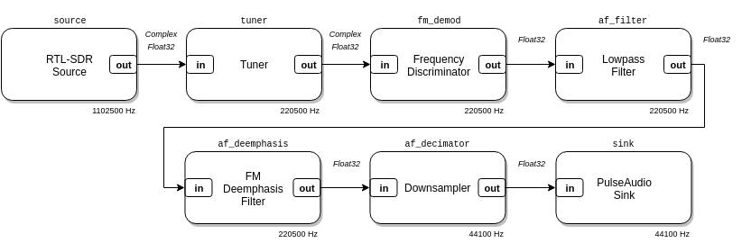
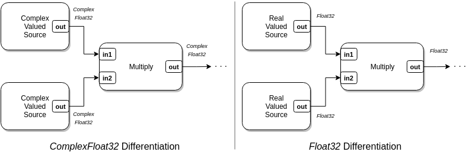
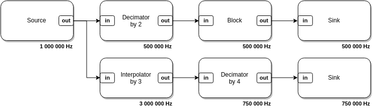
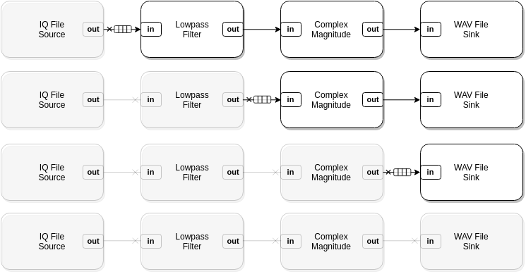
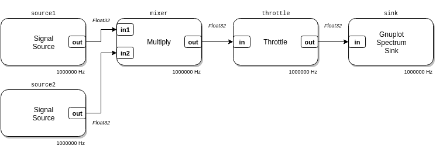
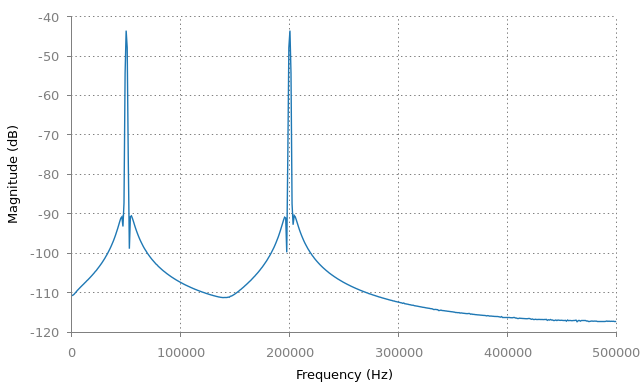

# Getting Started

## Introduction

<p align="center">

</p>

LuaRadio is a framework for defining and running signal processing flow graphs.
A flow graph is a directed graph of blocks that processes samples. Samples in a
flow graph originate at source blocks, get manipulated through intermediate
processing blocks, and terminate at sink blocks.  This paradigm — also called
dataflow programming — is useful for software defined radio, because it allows
you to build programs that model the architectures of conventional hardware
radios.

In software defined radio flow graphs, source and sink blocks tend to implement
some kind of I/O, like reading samples from an SDR dongle, or writing samples
to an IQ file, while processing blocks tend to be computational, like filters
and multipliers.

### Type Signatures

<p align="center">

</p>

LuaRadio blocks have data types associated with their input and output ports.
For example, a multiplier block may support two complex-valued inputs named
`in1` and `in2`, and a complex-valued output named `out`.  It may also support
two real-valued inputs named `in1` and `in2`, and a real-valued output named
`out`.  Each collection of data types associated with the input and output
ports is called a type signature.

<p align="center">

</p>

LuaRadio chooses the correct type signature for each block in a flow graph, so
that output and input types match in the connections between blocks.

### Sample Rate

<p align="center">

</p>

LuaRadio blocks have a sample rate associated with them. This is the rate at
which the discrete samples are spaced in time, relative to one another, but not
the rate that they are computationally produced, processed, or consumed by the
framework.  Source blocks define their sample rates, while downstream blocks
inherit — and possibly modify — the sample rate of their upstream block.  For
example, interpolator and decimator blocks will multiply and divide the sample
rate, respectively.

LuaRadio propagates sample rates between blocks for you. Blocks can access
their runtime sample rate to perform sample rate dependent initialization and
computations.

### Flow Graph Termination

<p align="center">

</p>

While some flow graphs may describe a continuously running system (e.g. a
Wideband FM receiver), LuaRadio flow graphs do not necessarily run forever. If
a source terminates, the framework will gracefully collapse the flow graph as
the final samples propagate their way though the graph. This allows you to
build utilities with LuaRadio that process files to completion, or to use it as
an engine for processing finite length data.

## Example

In this example, we will create a simple flow graph to mix two cosine signals.
It will demonstrate the basic mechanics of instantiating blocks, connecting
blocks, and running a flow graph.

<p align="center">

</p>

``` lua
local radio = require('radio')

-- Blocks
local source1 = radio.SignalSource('cosine', 125e3, 1e6) -- 125 KHz cosine source, sampled at 1 MHz
local source2 = radio.SignalSource('cosine', 75e3, 1e6)  -- 75 KHz cosine source, sampled at 1 MHz
local mixer = radio.MultiplyBlock()                      -- Multiply block
local throttle = radio.ThrottleBlock()                   -- Throttle block
local sink = radio.GnuplotSpectrumSink()                 -- Spectrum plotting sink
local top = radio.CompositeBlock()                       -- Top-level block to contain the flow graph

-- Connections
top:connect(source1, 'out', mixer, 'in1')
top:connect(source2, 'out', mixer, 'in2')
top:connect(mixer, throttle, sink)

-- Run it
top:run()
```

Run the flow graph with the `luaradio` runner:

```
$ ./luaradio test.lua
```

The flow graph can be terminated with Ctrl-C / `SIGINT`.

This flow graph multiples two tones at 125 KHz and 75 KHz to create the sum and
difference frequency tones at 200 KHz and 50 KHz, respectively.

The two sources produce real-valued sinusoids at 125 KHz and 75 KHz and are
connected to the inputs of the multiplier. The output of the multiplier is
connected to a throttle block, which artificially throttles processing to limit
CPU usage. The throttle block is connected to a gnuplot spectrum sink, which
plots the frequency spectrum of the signal with gnuplot. This flow graph
produces the plot below:

<p align="center">

</p>

### Explanation

The first line of the example imports the `radio` package under the local
variable `radio`. This package exposes all LuaRadio blocks, as well the
facilities to create custom blocks and types.

The lines in the blocks section instantiate each block of the flow graph. Each
block's constructor is documented in the [LuaRadio Reference
Manual](0.reference-manual.md). Note that sample rate parameters are only
required for the source blocks — all other blocks inherit their sample rate
through the connections in the flow graph.

The last line of the blocks section instantiates a special kind of block,
called the [`CompositeBlock`](0.reference-manual.md#compositeblock). A
composite block is a composition of blocks, created for one of two purposes:
either for a top-level block, a composition of blocks forming a complete flow
graph that can be run, or for a hierarchical block, a composition of blocks
abstracted into one block. In this example, we create a `CompositeBlock` to
serve as a top-level block that contains a complete flow graph.

The lines in the connections section specify the connections between blocks,
inside the top-level block, which form the complete flow graph.

The first two connections demonstrate the explicit connection syntax. For
instance, `top:connect(source1, 'out', mixer, 'in1')`, where `source1`'s output
port named `out` is explicitly connected the `mixer`'s input port named `in1`.
In this case, the mixer has two inputs, `in1` and `in2`, so we use the explicit
connection syntax to specify which input the source block output should connect
to.

The third connection demonstrates the linear block connection syntax. This
syntax will take any number of blocks, e.g.  `top:connect(b1, b2, b3, ...)`,
and connect the first output to the first input of each adjacent block. This
syntax is convenient for connecting chains of blocks that only have one input
and output, which is most blocks.

The input and output ports for each block, and their supported data types, are
documented in the [LuaRadio Reference Manual](0.reference-manual.md).

The last line of the example runs the flow graph. This line will block until
the flow graph terminates, either naturally by an exiting source, or forcibly
by a user's `SIGINT` signal. In this case, the cosine signal generator sources
will generate samples indefinitely, so this flow graph will only terminate by a
user's `SIGINT` signal.

## Types and Blocks

Building flow graphs with LuaRadio is a matter of choosing the right blocks and
connecting them.  The [LuaRadio Reference Manual](0.reference-manual.md)
documents all packaged blocks, including a description of their operation,
their arguments, and their input/output port names and data types. Creating
custom blocks is easy, too, and covered in the next guide, [Creating
Blocks](3.creating-blocks.md).

LuaRadio blocks may support multiple type signatures for their input and output
ports, but only blocks with compatible output and input types can be connected.
When LuaRadio initializes a flow graph, it differentiates each block based on
its input data types to the correct type signature.  LuaRadio will raise an
error if a block does not support a type signature that matches its input data
types.

LuaRadio comes with four basic data types:

* [`ComplexFloat32`](0.reference-manual.md#complexfloat32), compatible with the
  `float complex` C type
* [`Float32`](0.reference-manual.md#float32), the `float` C type
* [`Byte`](0.reference-manual.md#byte), the `uint8_t` C type
* [`Bit`](0.reference-manual.md#bit), a single-bit value stored in the
  `uint8_t` C type

Under the hood, the framework moves vectors of contiguous samples between
blocks for processing. Since these vectors are simply dynamic arrays of C
types, LuaRadio blocks can leverage the [LuaJIT foreign function interface
(FFI)](http://luajit.org/ext_ffi.html) to call external libraries to process
them.

In addition, users may create custom data types based on C structures or Lua
objects that are serializable between processing blocks. See the [Custom
Types](3.creating-blocks.md#custom-types) section in the next guide.

## Caveats

The LuaRadio architecture has a few important caveats.

##### Flow graphs must be acyclic.

Feedback loops cannot be implemented by blocks connected in a cycle.  Instead,
operations that require feedback loops must be implemented entirely within a
block (for example, the [PLLBlock](0.reference-manual.md#pllblock)).

##### Blocks cannot be manipulated after a flow graph is running.

Blocks must get all of the settings they need before they are run in a flow
graph. This means that building applications that require runtime modifications
to blocks — for example, programmatically retuning the frequency of an SDR
source to build a spectrum analyzer —  is not possible without implementing
out-of-band messaging to the block.

## Next Steps...

See the next guide, [Creating Blocks](3.creating-blocks.md), for details on
creating your own LuaRadio blocks.
