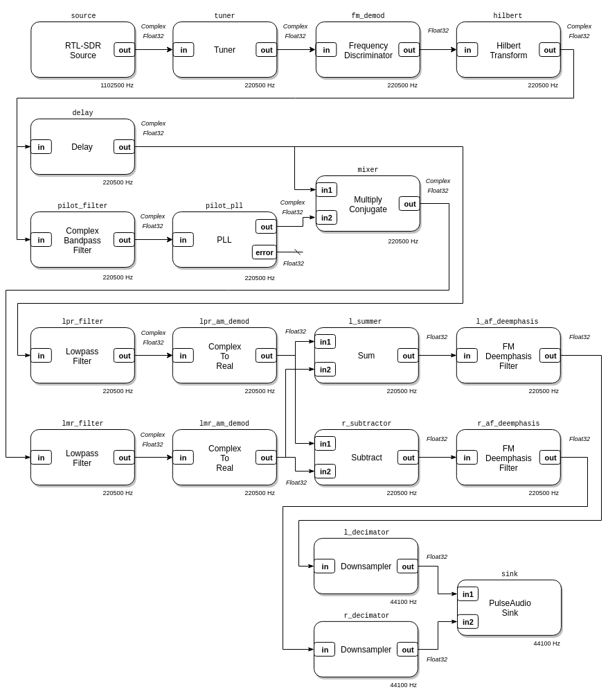
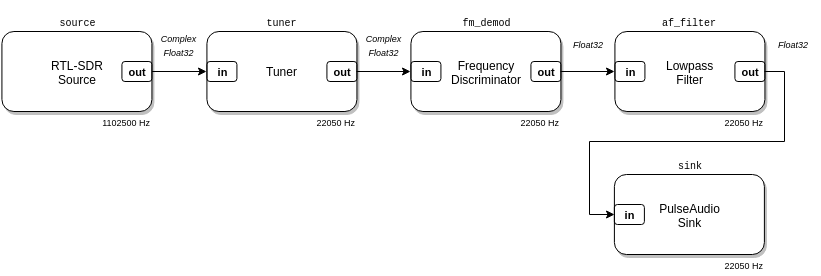
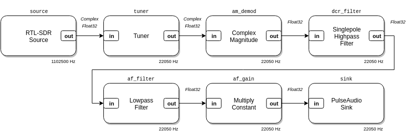
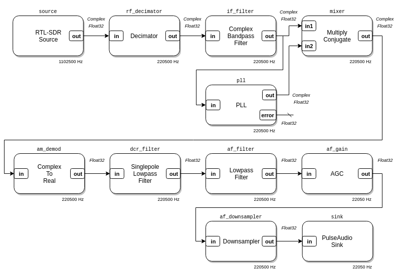
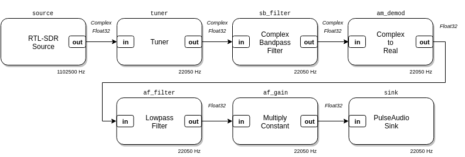
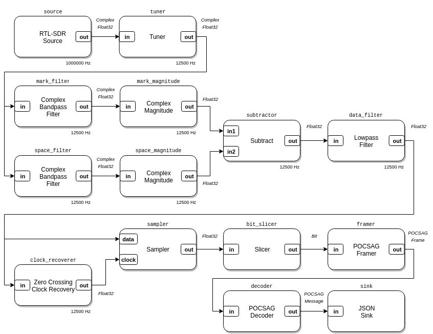

# Examples

### [`rtlsdr_wbfm_mono.lua`](rtlsdr_wbfm_mono.lua)

<p align="center">

</p>

```
Usage: examples/rtlsdr_wbfm_mono.lua <FM radio frequency>
```

This example is a mono Wideband FM radio receiver. It can be used to listen to
[FM Broadcast](https://en.wikipedia.org/wiki/FM_broadcasting) stations. It uses
the RTL-SDR as an SDR source, plays audio with PulseAudio, and shows two
real-time plots: the demodulated FM spectrum and the L+R channel audio
spectrum.

Listen to 91.1 MHz:

```
$ ./luaradio examples/rtlsdr_wbfm_mono.lua 91.1e6
```

### [`rtlsdr_wbfm_stereo.lua`](rtlsdr_wbfm_stereo.lua)

<p align="center">

</p>

```
Usage: examples/rtlsdr_wbfm_stereo.lua <FM radio frequency>
```

This example is a stereo Wideband FM radio receiver. It can be used to listen
to [FM Broadcast](https://en.wikipedia.org/wiki/FM_broadcasting) stations, like
the previous example, but supports stereo sound. It uses the RTL-SDR as a
source, plays audio with PulseAudio, and shows three real-time plots: the
demodulated FM spectrum, the L+R channel audio spectrum, and the L-R channel
audio spectrum.

Listen to 91.1 MHz:

```
$ ./luaradio examples/rtlsdr_wbfm_stereo.lua 91.1e6
```

### [`rtlsdr_nbfm.lua`](rtlsdr_nbfm.lua)

<p align="center">

</p>

```
Usage: examples/rtlsdr_nbfm.lua <frequency>
```

This example is a Narrowband FM radio receiver. It can be used to listen to
NOAA weather radio, many amateur radio repeaters, analog police and emergency
services, and more. It uses the RTL-SDR as an SDR source, plays audio with
PulseAudio, and shows two real-time plots: the RF spectrum and the demodulated
audio spectrum.

Listen to NOAA1, 162.400 MHz:

```
$ ./luaradio examples/rtlsdr_nbfm.lua 162.400e6
```

Additional [NOAA weather
radio](http://www.nws.noaa.gov/nwr/coverage/station_listing.html) station
frequencies: 162.400 MHz (NOAA1), 162.425 MHz (NOAA2), 162.450 MHz (NOAA3),
162.475 MHz (NOAA4), 162.500 MHz (NOAA5), 162.525 MHz (NOAA6), 162.550 MHZ
(NOAA7).

### [`rtlsdr_am_envelope.lua`](rtlsdr_am_envelope.lua)

<p align="center">

</p>

```
Usage: examples/rtlsdr_am_envelope.lua <frequency> [audio gain]
```

This example is an AM radio receiver, implemented with an envelope detector. It
can be used to listen to broadcast stations in the MF ([AM
Broadcast](https://en.wikipedia.org/wiki/AM_broadcasting)) and HF ([Shortwave
Broadcast](https://en.wikipedia.org/wiki/Shortwave_radio#Shortwave_broadcasting))
bands, as well as aviation communication in the
[airband](https://en.wikipedia.org/wiki/Airband). It uses the RTL-SDR as an SDR
source, plays audio with PulseAudio, and shows two real-time plots: the RF
spectrum and the demodulated audio spectrum.

This example requires a hardware upconverter to listen to stations in the HF
and MF bands with the RTL-SDR.

Listen to [WWV](https://en.wikipedia.org/wiki/WWV_(radio_station)) at 5 MHz
(with a 125 MHz upconverter), with an audio gain of 40:

```
$ ./luaradio examples/rtlsdr_am_envelope.lua 130e6 40
```

Listen to an AM radio station at 560 KHz (with a 125 MHz upconverter), with an
audio gain of 40:

```
$ ./luaradio examples/rtlsdr_am_envelope.lua 125.560e6 40
```

This example currently uses a constant audio gain block, which may need
adjustment with the station signal strength. In the future, this will be
replaced with an automatic gain control block.

### [`rtlsdr_am_synchronous.lua`](rtlsdr_am_synchronous.lua)

<p align="center">

</p>

```
Usage: examples/rtlsdr_am_synchronous.lua <frequency> [audio gain]
```

This example is an AM radio receiver, implemented with a phase-locked loop for
synchronous demodulation. It can be used to listen to broadcast stations in the
MF ([AM Broadcast](https://en.wikipedia.org/wiki/AM_broadcasting)) and HF
([Shortwave
Broadcast](https://en.wikipedia.org/wiki/Shortwave_radio#Shortwave_broadcasting))
bands, as well as aviation communication in the
[airband](https://en.wikipedia.org/wiki/Airband). It uses the RTL-SDR as an SDR
source, plays audio with PulseAudio, and shows two real-time plots: the RF
spectrum and the demodulated audio spectrum.

This example requires a hardware upconverter to listen to stations in the HF
and MF bands with the RTL-SDR.

Listen to [WWV](https://en.wikipedia.org/wiki/WWV_(radio_station)) at 5 MHz
(with a 125 MHz upconverter), with an audio gain of 40:

```
$ ./luaradio examples/rtlsdr_am_synchronous.lua 130e6 40
```

Listen to an AM radio station at 560 KHz (with a 125 MHz upconverter), with an
audio gain of 40:

```
$ ./luaradio examples/rtlsdr_am_synchronous.lua 125.560e6 40
```

This example currently uses a constant audio gain block, which may need
adjustment with the station signal strength. In the future, this will be
replaced with an automatic gain control block.

### [`rtlsdr_ssb.lua`](rtlsdr_ssb.lua)

<p align="center">

</p>

```
Usage: examples/rtlsdr_ssb.lua <frequency> <sideband> [audio gain]
```

This example is a Single-Sideband
([SSB](https://en.wikipedia.org/wiki/Single-sideband_modulation)) AM radio
receiver. SSB is commonly used by amateur radio operators on the HF band, and
sometimes on the VHF and UHF bands, for voice and digital (modulated in the
audio band) communication. This example uses the RTL-SDR as an SDR source,
plays audio with PulseAudio, and shows two real-time plots: the RF spectrum and
the demodulated audio spectrum.

This example requires a hardware upconverter to listen to stations in the HF
and MF bands with the RTL-SDR.

Listen to 3.8 MHz (with a 125 MHz upconverter), lower sideband, with an audio
gain of 40:

```
$ ./luaradio examples/rtlsdr_ssb.lua 128.8e6 lsb 40
```

This example currently uses a constant audio gain block, which may need
adjustment with the station signal strength. In the future, this will be
replaced with an automatic gain control block.

### [`rtlsdr_ax25.lua`](rtlsdr_ax25.lua)

<p align="center">

</p>

```
Usage: examples/rtlsdr_ax25.lua <frequency>
```

This example is an [AX.25](https://en.wikipedia.org/wiki/AX.25) packet radio
receiver for Narrowband FM, Bell 202 AFSK modulated transmissions on VHF and
UHF. It can be used to receive
[APRS](https://en.wikipedia.org/wiki/Automatic_Packet_Reporting_System) and
other amateur radio AX.25-based data transmissions. It uses the RTL-SDR as an
SDR source, writes decoded AX.25 frames in JSON to standard out, and shows two
real-time plots: the RF spectrum and the demodulated bitstream.

Receive APRS on 144.390 MHz, the North American VHF APRS frequency:

```
$ ./luaradio examples/rtlsdr_ax25.lua 144.390e6
{"payload":"@030151z3845.28N/12035.52W_000/000g000t054r000p000P000h70b10136/ {UIV32N}\r","control":3,"addresses":[{"ssid":48,"callsign":"APU25N"},{"ssid":112,"callsign":"K6GER "},{"ssid":112,"callsign":"WARD  "},{"ssid":115,"callsign":"N6ZX  "},{"ssid":112,"callsign":"WIDE2 "}],"pid":240}
{"payload":"`2-1l 5k/'\"3r}GTARC 146.805 & 406.600 both (-) PL 100|)2%n']|!w?;!|3","control":3,"addresses":[{"ssid":48,"callsign":"S8QXXW"},{"ssid":57,"callsign":"KJ6PCW"},{"ssid":115,"callsign":"N6ZX  "},{"ssid":112,"callsign":"WIDE1 "},{"ssid":49,"callsign":"WIDE2 "}],"pid":240}
{"payload":"`2-1l 5k/'\"3r}GTARC 146.805 & 406.600 both (-) PL 100|)2%n']|!w?;!|3","control":3,"addresses":[{"ssid":48,"callsign":"S8QXXW"},{"ssid":57,"callsign":"KJ6PCW"},{"ssid":115,"callsign":"N6ZX  "},{"ssid":112,"callsign":"WIDE1 "},{"ssid":112,"callsign":"BKELEY"},{"ssid":112,"callsign":"WIDE2 "}],"pid":240}
{"payload":"@094656h3754.16NI12216.92W&(Time 0:00:00)PHG3340/Kensington, CA (I-GATE) */A=000404","control":3,"addresses":[{"ssid":112,"callsign":"APWW10"},{"ssid":53,"callsign":"KC6SSM"},{"ssid":115,"callsign":"N6ZX  "},{"ssid":112,"callsign":"WIDE1 "},{"ssid":49,"callsign":"WIDE2 "}],"pid":240}
{"payload":"!3956.16N/12138.86W# 13.6V 62F ","control":3,"addresses":[{"ssid":112,"callsign":"APOT30"},{"ssid":115,"callsign":"W6SCR "},{"ssid":115,"callsign":"N6ZX  "},{"ssid":112,"callsign":"WIDE1 "}],"pid":240}
{"payload":"`1N8l#K>/`\"4{}443.575MHz T110 +500_%\r","control":3,"addresses":[{"ssid":48,"callsign":"SWRSYY"},{"ssid":121,"callsign":"KE6STH"},{"ssid":115,"callsign":"N6ZX  "},{"ssid":112,"callsign":"WIDE1 "},{"ssid":49,"callsign":"WIDE2 "}],"pid":240}
{"payload":"`1N8l#K>/`\"4{}443.575MHz T110 +500_%\r","control":3,"addresses":[{"ssid":48,"callsign":"SWRSYY"},{"ssid":121,"callsign":"KE6STH"},{"ssid":115,"callsign":"N6ZX  "},{"ssid":112,"callsign":"WIDE1 "},{"ssid":112,"callsign":"BKELEY"},{"ssid":112,"callsign":"WIDE2 "}],"pid":240}
{"payload":"@270947z3715.26N/12153.30W#Digi & Igate / ron@k6rpt.com","control":3,"addresses":[{"ssid":48,"callsign":"APMI06"},{"ssid":48,"callsign":"K6RPT "},{"ssid":115,"callsign":"N6ZX  "},{"ssid":49,"callsign":"WIDE2 "}],"pid":240}
{"payload":"@270947z3715.26N/12153.30W#Digi & Igate / ron@k6rpt.com","control":3,"addresses":[{"ssid":48,"callsign":"APMI06"},{"ssid":48,"callsign":"K6RPT "},{"ssid":115,"callsign":"N6ZX  "},{"ssid":112,"callsign":"BKELEY"},{"ssid":112,"callsign":"WIDE2 "}],"pid":240}
{"payload":"!4001.07N/12122.89W# 12.8V 44F K6FHL Highlakes Fillin W1","control":3,"addresses":[{"ssid":112,"callsign":"APOT30"},{"ssid":112,"callsign":"HILAKE"},{"ssid":115,"callsign":"N6ZX  "},{"ssid":112,"callsign":"WIDE2 "}],"pid":240}
...
```

### [`rtlsdr_pocsag.lua`](rtlsdr_pocsag.lua)

<p align="center">

</p>

```
Usage: examples/rtlsdr_pocsag.lua <frequency>
```

This example is a [POCSAG](https://en.wikipedia.org/wiki/POCSAG) receiver. It
can be used to receive pager messages from hospital, fire, emergency, and
police services, as well as some businesses. (POCSAG messages are transmitted
in plaintext.) It uses the RTL-SDR as an SDR source, writes decoded POCSAG
messages in JSON to standard out, and shows two real-time plots: the RF
spectrum and the demodulated bitstream.

You may need to explore your local spectrum with a waterfall receiver to find a
POCSAG transmitter.

Receive POCSAG on 152.240 MHz:

```
$ ./luaradio examples/rtlsdr_pocsag.lua 152.240e6
{"address":1234567,"func":2,"alphanumeric":"THIS IS A TEST PERIODIC PAGE SEQUENTIAL NUMBER  1973"}
{"address":234567,"func":2,"alphanumeric":"THIS IS A TEST PERIODIC PAGE SEQUENTIAL NUMBER  1973"}
{"address":1234567,"func":2,"alphanumeric":"THIS IS A TEST PERIODIC PAGE SEQUENTIAL NUMBER  1974"}
{"address":234567,"func":2,"alphanumeric":"THIS IS A TEST PERIODIC PAGE SEQUENTIAL NUMBER  1974"}
{"address":1234567,"func":2,"alphanumeric":"THIS IS A TEST PERIODIC PAGE SEQUENTIAL NUMBER  1975"}
{"address":234567,"func":2,"alphanumeric":"THIS IS A TEST PERIODIC PAGE SEQUENTIAL NUMBER  1975"}
...
```

### [`rtlsdr_rds.lua`](rtlsdr_rds.lua)

<p align="center">

</p>

```
Usage: examples/rtlsdr_rds.lua <FM radio frequency>
```

This example is a Radio Data System
([RDS](https://en.wikipedia.org/wiki/Radio_Data_System)) receiver. RDS is a
digital protocol used by [FM
Broadcast](https://en.wikipedia.org/wiki/FM_broadcasting) radio stations to
transmit metadata about the station and its programming. This protocol is most
commonly known for providing station and song text information with "RadioText"
messages.  This examples uses the RTL-SDR as an SDR source, writes decoded RDS
frames in JSON to standard out, and shows three real-time plots: the
demodulated FM spectrum, the BPSK spectrum, and the BPSK constellation.

This example can be used with FM Broadcast radio stations, like the
`rtlsdr_wbfm_mono.lua` and `rtlsdr_wbfm_stereo.lua` examples, but may require a
decent antenna or a strong station.

Receive RDS on 88.5 MHz:

```
$ ./luaradio examples/rtlsdr_rds.lua 88.5e6
{"header":{"pi_code":15019,"tp_code":0,"group_code":0,"group_version":0,"pty_code":22},"data":{"text_data":"  ","di_position":0,"text_address":3,"ms_code":1,"di_value":1,"af_code":[6,8],"type":"basictuning","ta_code":0}}
{"header":{"pi_code":15019,"tp_code":0,"group_code":2,"group_version":0,"pty_code":22},"data":{"type":"radiotext","text_data":"Nort","text_address":6,"ab_flag":0}}
{"header":{"pi_code":15019,"tp_code":0,"group_code":0,"group_version":0,"pty_code":22},"data":{"text_data":"KQ","di_position":3,"text_address":0,"ms_code":1,"di_value":0,"af_code":[227,10],"type":"basictuning","ta_code":0}}
{"header":{"pi_code":15019,"tp_code":0,"group_code":2,"group_version":0,"pty_code":22},"data":{"type":"radiotext","text_data":"hern","text_address":7,"ab_flag":0}}
{"header":{"pi_code":15019,"tp_code":0,"group_code":0,"group_version":0,"pty_code":22},"data":{"text_data":"ED","di_position":2,"text_address":1,"ms_code":1,"di_value":0,"af_code":[6,8],"type":"basictuning","ta_code":0}}
{"header":{"pi_code":15019,"tp_code":0,"group_code":1,"group_version":0,"pty_code":22},"data":{"type":"raw","frame":[15019,4805,160,2002]}}
{"header":{"pi_code":15019,"tp_code":0,"group_code":0,"group_version":0,"pty_code":22},"data":{"text_data":"  ","di_position":1,"text_address":2,"ms_code":1,"di_value":0,"af_code":[227,10],"type":"basictuning","ta_code":0}}
{"header":{"pi_code":15019,"tp_code":0,"group_code":8,"group_version":0,"pty_code":22},"data":{"type":"raw","frame":[15019,33494,24158,16374]}}
{"header":{"pi_code":15019,"tp_code":0,"group_code":0,"group_version":0,"pty_code":22},"data":{"text_data":"  ","di_position":0,"text_address":3,"ms_code":1,"di_value":1,"af_code":[6,8],"type":"basictuning","ta_code":0}}
{"header":{"pi_code":15019,"tp_code":0,"group_code":2,"group_version":0,"pty_code":22},"data":{"type":"radiotext","text_data":" Cal","text_address":8,"ab_flag":0}}
{"header":{"pi_code":15019,"tp_code":0,"group_code":8,"group_version":0,"pty_code":22},"data":{"type":"raw","frame":[15019,33494,24158,16374]}}
{"header":{"pi_code":15019,"tp_code":0,"group_code":0,"group_version":0,"pty_code":22},"data":{"text_data":"KQ","di_position":3,"text_address":0,"ms_code":1,"di_value":0,"af_code":[227,10],"type":"basictuning","ta_code":0}}
{"header":{"pi_code":15019,"tp_code":0,"group_code":3,"group_version":0,"pty_code":22},"data":{"type":"raw","frame":[15019,13008,16833,52550]}}
{"header":{"pi_code":15019,"tp_code":0,"group_code":0,"group_version":0,"pty_code":22},"data":{"text_data":"ED","di_position":2,"text_address":1,"ms_code":1,"di_value":0,"af_code":[6,8],"type":"basictuning","ta_code":0}}
{"header":{"pi_code":15019,"tp_code":0,"group_code":8,"group_version":0,"pty_code":22},"data":{"type":"raw","frame":[15019,33494,24158,16374]}}
{"header":{"pi_code":15019,"tp_code":0,"group_code":0,"group_version":0,"pty_code":22},"data":{"text_data":"  ","di_position":1,"text_address":2,"ms_code":1,"di_value":0,"af_code":[227,10],"type":"basictuning","ta_code":0}}
{"header":{"pi_code":15019,"tp_code":0,"group_code":4,"group_version":0,"pty_code":22},"data":{"type":"datetime","time":{"offset":-7,"hour":9,"minute":57},"date":{"day":27,"year":2016,"month":5}}}
{"header":{"pi_code":15019,"tp_code":0,"group_code":8,"group_version":0,"pty_code":22},"data":{"type":"raw","frame":[15019,33494,28270,16202]}}
{"header":{"pi_code":15019,"tp_code":0,"group_code":0,"group_version":0,"pty_code":22},"data":{"text_data":"  ","di_position":0,"text_address":3,"ms_code":1,"di_value":1,"af_code":[6,8],"type":"basictuning","ta_code":0}}
{"header":{"pi_code":15019,"tp_code":0,"group_code":2,"group_version":0,"pty_code":22},"data":{"type":"radiotext","text_data":"ifor","text_address":9,"ab_flag":0}}
{"header":{"pi_code":15019,"tp_code":0,"group_code":0,"group_version":0,"pty_code":22},"data":{"text_data":"KQ","di_position":3,"text_address":0,"ms_code":1,"di_value":0,"af_code":[227,10],"type":"basictuning","ta_code":0}}
{"header":{"pi_code":15019,"tp_code":0,"group_code":8,"group_version":0,"pty_code":22},"data":{"type":"raw","frame":[15019,33494,28270,16202]}}
{"header":{"pi_code":15019,"tp_code":0,"group_code":0,"group_version":0,"pty_code":22},"data":{"text_data":"ED","di_position":2,"text_address":1,"ms_code":1,"di_value":0,"af_code":[6,8],"type":"basictuning","ta_code":0}}
{"header":{"pi_code":15019,"tp_code":0,"group_code":0,"group_version":0,"pty_code":22},"data":{"text_data":"  ","di_position":1,"text_address":2,"ms_code":1,"di_value":0,"af_code":[227,10],"type":"basictuning","ta_code":0}}
{"header":{"pi_code":15019,"tp_code":0,"group_code":8,"group_version":0,"pty_code":22},"data":{"type":"raw","frame":[15019,33494,28270,16202]}}
{"header":{"pi_code":15019,"tp_code":0,"group_code":0,"group_version":0,"pty_code":22},"data":{"text_data":"  ","di_position":0,"text_address":3,"ms_code":1,"di_value":1,"af_code":[6,8],"type":"basictuning","ta_code":0}}
{"header":{"pi_code":15019,"tp_code":0,"group_code":2,"group_version":0,"pty_code":22},"data":{"type":"radiotext","text_data":"nia ","text_address":10,"ab_flag":0}}
{"header":{"pi_code":15019,"tp_code":0,"group_code":1,"group_version":0,"pty_code":22},"data":{"type":"raw","frame":[15019,4806,160,2002]}}
...
```

### [`wavfile_ssb_modulator.lua`](wavfile_ssb_modulator.lua)

<p align="center">

</p>

```
Usage: examples/wavfile_ssb_modulator.lua <WAV file in> <IQ f32le file out> <bandwidth> <sideband>
```

This example is a file-based Single-Sideband
([SSB](https://en.wikipedia.org/wiki/Single-sideband_modulation)) modulator. It
takes a single channel WAV file as the input, and produces a binary IQ file
(`f32le` format) with the single-sideband modulated audio as the output. This
example doesn't use the RTL-SDR at all, but instead demonstrates how you can
build file-based command-line utilities with modulation/demodulation, decoding,
conversion, etc.  flow graphs that run to completion.

Modulate `test.wav` into `test.iq`, with 3 KHz bandwidth and lower sideband:

```
$ ./luaradio examples/wavfile_ssb_modulator.lua test.wav test.iq 3e3 lsb
```

### [`iqfile_converter.lua`](iqfile_converter.lua)

<p align="center">

</p>

```
Usage: examples/iqfile_convert.lua <input IQ file> <input format> <output IQ file> <output format>

Supported formats:
    s8, u8,
    u16le, u16be, s16le, s16be,
    u32le, u32be, s32le, s32be,
    f32le, f32be, f64le, f64be
```

This example is an IQ file format converter. It converts the binary encoding of
IQ files from one format, e.g. signed 8-bit, to another, e.g. 32-bit float
little endian. This example doesn't use the RTL-SDR at all, but instead
demonstrates how you can build file-based command-line utilities with
modulation/demodulation, decoding, conversion, etc. flow graphs that run to
completion.

Convert `test.s8.iq`, with signed 8-bit samples, into `test.f32le.iq`, with
32-bit float little endian samples:

```
$ ./luaradio examples/iqfile_converter.lua test.s8.iq s8 test.f32le.iq f32le
```
